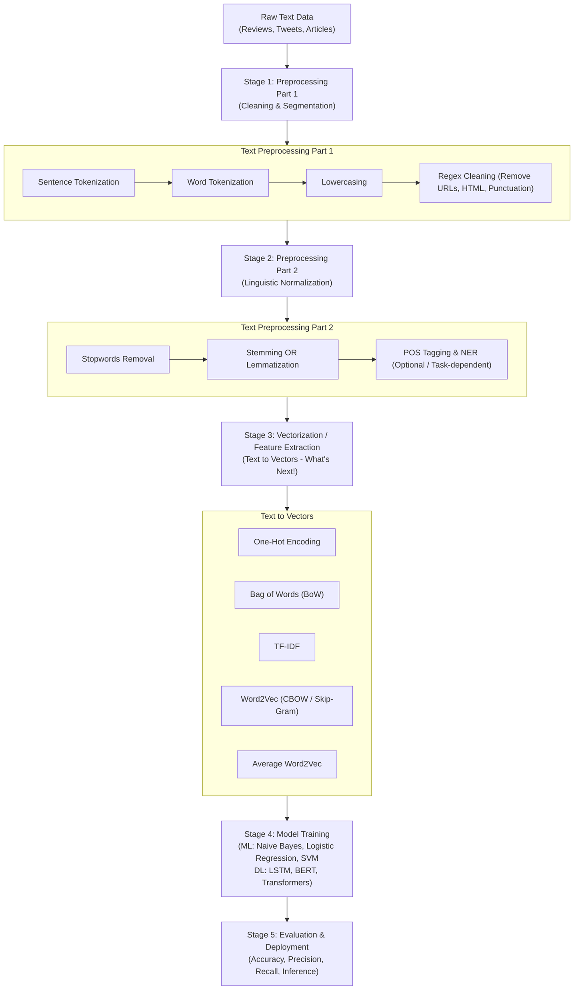
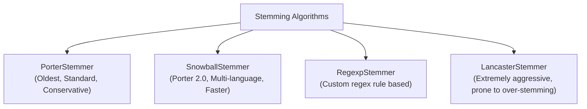
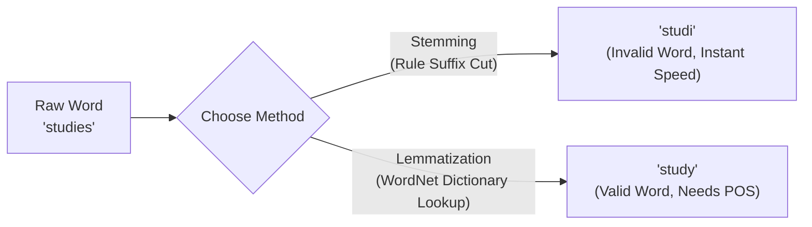
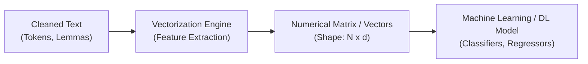

# Natural Language Processing (NLP): Text Pre-Processing Master Guide

> **Domain:** Natural Language Processing & Deep Learning   
> **Companion Files:** `01_tokenization_and_nlp_basics.ipynb`, `02_stemming_techniques.ipynb`, `03_lemmatization.ipynb`, `04_stopwords_pos_tagging_ner.ipynb`

---

## Table of Contents
1. [The NLP Lifecycle & End-to-End Pipeline](#1-the-nlp-lifecycle--end-to-end-pipeline)
2. [Core Foundational Vocabulary](#2-core-foundational-vocabulary)
3. [Phase 1: Segmentation & Text Cleaning](#3-phase-1-segmentation--text-cleaning)
   - [3.1 Tokenization (Sentence, Word, Punctuation, Regex)](#31-tokenization)
   - [3.2 Lowercasing (Case Normalization)](#32-lowercasing-case-normalization)
   - [3.3 Regular Expression Cleaning (`re`)](#33-regular-expression-cleaning-re)
4. [Phase 2: Linguistic Normalization & Filtering](#4-phase-2-linguistic-normalization--filtering)
   - [4.1 Stemming (Porter, Snowball, Regexp, Lancaster)](#41-stemming)
   - [4.2 Lemmatization (WordNet & The POS Tag Factor)](#42-lemmatization)
   - [4.3 Stemming vs Lemmatization: The Showdown](#43-stemming-vs-lemmatization-the-showdown)
   - [4.4 Stopwords Handling](#44-stopwords-handling)
   - [4.5 Part-of-Speech (POS) Tagging](#45-part-of-speech-pos-tagging)
   - [4.6 Named Entity Recognition (NER)](#46-named-entity-recognition-ner)
5. [The Bridge to What's Next: Text-to-Vectors](#5-the-bridge-to-whats-next-text-to-vectors)
   - [5.1 Why Text-to-Vectors?](#51-why-text-to-vectors)
   - [5.2 Preview of Vectorization Techniques](#52-preview-of-vectorization-techniques)
     - [One-Hot Encoding (OHE)](#1-one-hot-encoding-ohe)
     - [Bag of Words (BoW)](#2-bag-of-words-bow)
     - [TF-IDF (Term Frequency - Inverse Document Frequency)](#3-tf-idf)
     - [Word2Vec (Embeddings) & Gensim](#4-word2vec-dense-embeddings)
     - [Average Word2Vec](#5-average-word2vec)
   - [5.3 Vectorization Comparison Matrix](#53-vectorization-comparison-matrix)
6. [Best Practices & Pipeline Order Checklist](#6-best-practices--pipeline-order-checklist)

---

## 1. The NLP Lifecycle & End-to-End Pipeline

In any Natural Language Processing application (e.g., Sentiment Analysis, Spam Detection, Topic Modeling, Chatbots), raw text cannot be directly fed into machine learning or deep learning algorithms. It must pass through a systematic multi-stage lifecycle.



---

## 2. Core Foundational Vocabulary

To navigate NLP literature, research, and production systems, understand these 5 core building blocks:

| Term | Intuitive Definition | Real-World Analogy | Mathematical / Formal Meaning |
| :--- | :--- | :--- | :--- |
| **Corpus ($C$)** | The entire text dataset you are working with. | An entire library or encyclopedia. | $C = \{D_1, D_2, \dots, D_N\}$ |
| **Document ($D_i$)** | A single distinct data entry or record within the corpus. | A single book, tweet, review, or article. | $D_i \in C$, where $D_i$ is a sequence of words. |
| **Vocabulary ($V$)** | The set of all unique, distinct words present across the whole corpus. | The glossary / dictionary containing only words that appeared in your dataset. | $V = \text{Unique}(\bigcup_{i=1}^N \text{Words}(D_i))$, Size = $\|V\|$ |
| **Word / Token** | An atomic linguistic unit produced after segmentation. | Individual bricks used to construct a wall. | $w_j \in D_i$ |
| **Vector ($\mathbf{v}$)** | A numeric array representing a token, sentence, or document. | GPS coordinates pointing to a specific concept in mathematical space. | $\mathbf{v} \in \mathbb{R}^d$, where $d$ is the feature dimension. |

---

## 3. Phase 1: Segmentation & Text Cleaning

### 3.1 Tokenization

#### Intuitive Definition
Tokenization is the process of breaking a continuous stream of text into smaller, meaningful chunks called **tokens**. It is the absolute foundational step because computers cannot reason about an unbroken string of characters; they require discrete units to analyze.

```
"Artificial intelligence is great. It helps humanity!"
                   │
                   ▼  (Sentence Tokenization)
["Artificial intelligence is great.", "It helps humanity!"]
                   │
                   ▼  (Word Tokenization)
["Artificial", "intelligence", "is", "great", ".", "It", "helps", "humanity", "!"]
```

#### Tokenizer Breakdown

##### 1. Sentence Tokenizer (`sent_tokenize`)
- **How it works:** Uses the unsupervised **Punkt Sentence Tokenizer** algorithm pre-trained on English punctuation rules, abbreviation lists (e.g., `Mr.`, `Dr.`, `U.S.A.`), and sentence boundaries.
- **Advantage:** Doesn't naively split on every period. Understands that `Dr. Smith graduated from the U.S.` is one sentence.
- **Disadvantage:** Fails on messy social media text with missing periods or informal exclamation runs (`hey what are you doing lol`).

##### 2. Standard Word Tokenizer (`word_tokenize`)
- **How it works:** Uses the standard Treebank tokenizer combined with Punkt.
- **Behavior:** Separates punctuation marks into individual tokens while preserving contractions reasonably well (`don't` $\to$ `do`, `n't`).
- **Advantage:** Safe, versatile standard for English text.
- **Disadvantage:** Heavy dependency on NLTK data downloads (`punkt`, `punkt_tab`).

##### 3. WordPunctTokenizer (`WordPunctTokenizer`)
- **How it works:** Aggressively splits text into alphabetical sequences and non-whitespace punctuation characters using the regex `\w+|[^\w\s]+`.
- **Behavior:** `Krish Naik's` $\to$ `['Krish', 'Naik', "'", 's']`.
- **Advantage:** Extremely fast, deterministic, no pretrained models needed.
- **Disadvantage:** Destroys compound contractions and abbreviations into fragmented punctuation noise.

##### 4. Penn Treebank Word Tokenizer (`TreebankWordTokenizer`)
- **How it works:** Follows the linguistic conventions established by the Penn Treebank corpus. Specifically extracts contractions by isolating standard suffixes (`'s`, `'t`, `'ll`, `'ve`).
- **Advantage:** Preserves linguistic syntax required for POS taggers and dependency parsers.
- **Disadvantage:** Assumes sentence-tokenized input; fails when newlines and raw periods are mixed.

##### 5. Tweet Tokenizer (`TweetTokenizer`)
- **How it works:** Built specifically for noisy Web and social media text.
- **Special powers:** Preserves usernames (`@krishnaik06`), hashtags (`#NLP`), emojis (`:)`, `🔥`), and strips consecutive repeated characters (`yaaaaaay` $\to$ `yay`).
- **Advantage:** The only tokenizer suitable for Twitter, Reddit, and customer review datasets.
- **Disadvantage:** Overkill for formal text (legal, biomedical, news).

#### Tokenizer Comparison Matrix

| Tokenizer | Splitting Logic | Contraction (`don't`) | Punctuation Handling | Ideal Use Case |
| :--- | :--- | :--- | :--- | :--- |
| `sent_tokenize` | Punkt Sentence Model | Preserved within sentence | Sentence boundary delimiter | Document $\to$ Sentence splitting |
| `word_tokenize` | Punkt + Treebank regex | `['do', "n't"]` | Isolated into separate tokens | General NLP pipelines |
| `WordPunctTokenizer` | `\w+\|[^\w\s]+` | `['don', "'", 't']` | Splits every symbol separately | Low-level regex / symbol parsing |
| `TreebankWordTokenizer` | Treebank grammatical rules | `['do', "n't"]` | Delimited per grammatical rules | Syntactic parsing / POS pipelines |
| `TweetTokenizer` | Social media regex | Preserved or tailored | Handles emojis, @mentions, hashtags | Social media, chat, forum text |

---

### 3.2 Lowercasing (Case Normalization)

#### Intuitive Definition
Converting all characters in the text to lowercase (`"Apple"`, `"apple"`, and `"APPLE"` $\to$ `"apple"`).

#### Why is it Done?
Text matching in computer memory is based on ASCII / Unicode integer values. Without lowercasing:
- `"The"`, `"the"`, and `"THE"` would be treated as **3 completely different vocabulary words**.
- This needlessly triples the vocabulary size $\|V\|$, creating high sparsity in vector representations.

#### Advantages & Disadvantages

| Advantages | Disadvantages & Risks |
| :--- | :--- |
| Drastically reduces vocabulary size $\|V\|$. | **Loss of Meaning:** `"US"` (United States) becomes `"us"` (pronoun). |
| Solves sentence-starting capitalization mismatch. | **Loss of Entity Clues:** `"Apple"` (company) becomes `"apple"` (fruit). |
| Eliminates redundant duplicate features in BoW/TF-IDF. | **Loss of Sentiment Intensity:** `"I HATE THIS"` expresses far more emotion than `"i hate this"`. |

> [!IMPORTANT]
> **Production Rule:** Always perform **Named Entity Recognition (NER)** and **POS Tagging** *BEFORE* lowercasing your text, or ensure lowercasing is skipped for entity extraction.

---

### 3.3 Regular Expression Cleaning (`re`)

#### Intuitive Definition
Using pattern-matching rules to scrub non-informative noise (HTML markup, URL hyperlinks, non-alphanumeric symbols, emojis, stray numbers) out of raw text.

#### Core Regex Cleaning Patterns

```python
import re

def clean_text(text):
    # 1. Remove HTML tags
    text = re.sub(r'<.*?>', '', text)
    
    # 2. Remove URLs (http, https, www)
    text = re.sub(r'https?://\S+|www\.\S+', '', text)
    
    # 3. Remove email addresses
    text = re.sub(r'\S+@\S+', '', text)
    
    # 4. Remove special characters and punctuation (retain only letters and spaces)
    text = re.sub(r'[^a-zA-Z\s]', '', text)
    
    # 5. Remove multiple consecutive whitespace characters
    text = re.sub(r'\s+', ' ', text).strip()
    
    return text
```

#### Advantages & Disadvantages

| Advantages | Disadvantages |
| :--- | :--- |
| Removes non-linguistic noise (HTML artifacts, links). | Risk of removing meaningful punctuation (e.g. `$100` $\to$ `100`, losing currency). |
| Highly customizable to the exact problem domain. | Stripping punctuation removes sentence boundary clues. |
| Extremely fast execution in Python via compiled C regex. | Improper patterns can accidentally erase valid contractions (`can't` $\to$ `cant`). |

---

## 4. Phase 2: Linguistic Normalization & Filtering

### 4.1 Stemming

#### Intuitive Definition
Stemming is a **crude, heuristic rule-based technique** that chops off the affixes (prefixes and suffixes) of words to isolate the base "stem". It acts like a pair of blunt pruning shears: it cuts the end of a word regardless of whether the resulting string is an actual valid word in the dictionary.

```
eating, eats, eaten ───(Stemming)───► "eat"
studies, studying   ───(Stemming)───► "studi"  <-- NOT a dictionary word!
congratulations     ───(Stemming)───► "congratul"
```

#### The Two Classic Stemming Errors (Interview Favorite!)
1. **Over-Stemming:** When words of different meanings are mistakenly chopped down to the same root.
   - Example: `"university"`, `"universal"`, and `"universe"` all stemmed to `"univers"`. (They mean completely different things!)
2. **Under-Stemming:** When words that share the same conceptual root are not reduced to the same stem because rules fail to catch them.
   - Example: `"adhere"` $\to$ `"adher"`, but `"adhesion"` $\to$ `"adhes"`.

#### The 4 Types of Stemmers in NLTK



1. **Porter Stemmer (`PorterStemmer`):**
   - Developed by Martin Porter in 1980.
   - Operates through 5 sequential phases of rule-based suffix stripping.
   - *Example:* `'running'` $\to$ `'run'`, `'happily'` $\to$ `'happili'`.
2. **Snowball Stemmer (`SnowballStemmer`):**
   - Known as **Porter2**. An improved, more modern, slightly more aggressive version of Porter.
   - Supports multiple languages (English, French, German, Spanish, Russian, etc.).
   - Automatically handles lowercase conversions internally.
3. **Regexp Stemmer (`RegexpStemmer`):**
   - Allows users to define custom regular expressions to strip specific affixes.
   - *Example:* `RegexpStemmer('ing$|s$|e$|able$', min=4)`.
4. **Lancaster Stemmer (`LancasterStemmer`):**
   - Extremely aggressive algorithm developed at Lancaster University.
   - Often produces severely mutilated, illegible stems (e.g., `'maximum'` $\to$ `'maxi'`).

#### Advantages & Disadvantages of Stemming

| Advantages | Disadvantages |
| :--- | :--- |
| **Blazing Fast:** Pure string manipulation with zero dictionary lookup. | Output stems are often **invalid non-words** (`histori`, `intellig`). |
| **Low Memory Footprint:** Requires no external linguistic databases. | Semantic context and part-of-speech are completely ignored. |
| **Effective for Information Retrieval:** Works great for search engines & spam filters where exact word validity doesn't matter. | High vulnerability to **over-stemming** and **under-stemming**. |

---

### 4.2 Lemmatization

#### Intuitive Definition
Lemmatization is an **intelligent, linguistically informed process** that uses a vocabulary dictionary (like WordNet) and morphological analysis to return the base dictionary form of a word, known as the **Lemma**.

Unlike stemming, a lemma is **guaranteed to always be a valid, real dictionary word**.

```
"better"   ───(Lemmatization with POS='a')───► "good"   (Stemmer fails here!)
"went"     ───(Lemmatization with POS='v')───► "go"     (Stemmer fails here!)
"corpora"  ───(Lemmatization with POS='n')───► "corpus" (Stemmer fails here!)
```

#### The Critical Importance of Part-of-Speech (POS) in Lemmatization
In NLTK, `WordNetLemmatizer()` has a major pitfall: **It defaults to assuming every word is a Noun (`pos='n'`)**.

If you do not specify the POS tag:
- `lemmatizer.lemmatize("going")` $\to$ `"going"` *(No change! It thinks "going" is a noun!)*
- `lemmatizer.lemmatize("going", pos='v')` $\to$ `"go"` *(Correct! Verb detected)*
- `lemmatizer.lemmatize("better", pos='a')` $\to$ `"good"` *(Correct! Adjective detected)*

#### Automated POS-to-WordNet Mapper (Production Trick)
Since passing `pos` manually for millions of words is impossible, use this standard adapter function:

```python
from nltk.corpus import wordnet
from nltk.stem import WordNetLemmatizer
import nltk

def get_wordnet_pos(treebank_tag):
    """Map Penn Treebank POS tag to WordNet POS tag"""
    if treebank_tag.startswith('J'):
        return wordnet.ADJ
    elif treebank_tag.startswith('V'):
        return wordnet.VERB
    elif treebank_tag.startswith('N'):
        return wordnet.NOUN
    elif treebank_tag.startswith('R'):
        return wordnet.ADV
    else:
        return wordnet.NOUN  # Fallback default

lemmatizer = WordNetLemmatizer()
sentence = "The striped bats are hanging on their feet for best safety"
words = nltk.word_tokenize(sentence)
pos_tagged = nltk.pos_tag(words)

lemmatized_words = [lemmatizer.lemmatize(word, get_wordnet_pos(tag)) for word, tag in pos_tagged]
# Output: ['The', 'strip', 'bat', 'be', 'hang', 'on', 'their', 'foot', 'for', 'good', 'safety']
```

#### Advantages & Disadvantages of Lemmatization

| Advantages | Disadvantages |
| :--- | :--- |
| **Always produces valid words:** Guarantees linguistically correct lemmas. | **Slower Execution:** Requires database lookup into WordNet (`morphy()`). |
| **Handles Irregular Words:** Resolves irregular verbs (`went` $\to$ `go`) and comparative adjectives (`better` $\to$ `good`). | **Requires Accurate POS Tags:** Without POS information, accuracy drops significantly. |
| **Essential for Deep NLU:** Required for Chatbots, Question Answering, and Translation. | **Higher Resource Usage:** Demands more memory and computational overhead than stemming. |

---

### 4.3 Stemming vs Lemmatization: The Showdown



| Evaluation Metric | Stemming | Lemmatization |
| :--- | :--- | :--- |
| **Core Mechanism** | Heuristic rule-based suffix stripping | Morphological analysis + Dictionary lookup |
| **Output Validity** | May produce non-words (`histori`, `happi`) | Always produces real dictionary words (`history`, `happy`) |
| **Execution Speed** | Extremely fast (microseconds) | Moderate to slow (requires lexicon lookups) |
| **Memory Usage** | Minimal (lightweight rule tables) | Moderate (loads WordNet lexical database) |
| **POS Sensitivity** | Completely unaware of POS or context | Highly dependent on POS tags for accuracy |
| **Irregular Forms** | Cannot handle irregular forms (`went` $\to$ `went`) | Resolves irregular forms (`went` $\to$ `go`) |
| **When to Use** | 1. Search Engine Indexing (ElasticSearch/Solr)<br>2. Spam Detection / Bulk Document Sorting<br>3. Massive datasets where speed is paramount | 1. Conversational AI & Chatbots<br>2. Question Answering Systems<br>3. Text Summarization & Translation<br>4. Sentiment Analysis with nuanced grammar |

---

### 4.4 Stopwords Handling

#### Intuitive Definition
Stopwords are high-frequency grammatical words (e.g., `"the"`, `"is"`, `"at"`, `"which"`, `"on"`, `"and"`) that act as syntactic glue in human language but carry very little domain-specific semantic meaning for analytical models.

#### How to Filter Stopwords in NLTK
```python
from nltk.corpus import stopwords
import nltk

nltk.download('stopwords')
stop_words = set(stopwords.words('english'))

text = "This is a great book on natural language processing."
filtered = [word for word in text.split() if word.lower() not in stop_words]
# Result: ['great', 'book', 'natural', 'language', 'processing.']
```

#### Crucial Dilemma: When to REMOVE vs When to KEEP Stopwords

> [!CAUTION]
> Stopwords removal is **NOT** a one-size-fits-all rule! Removing stopwords blindly can destroy your model's accuracy on certain tasks.

| Scenario | Decision | Why? |
| :--- | :---: | :--- |
| **Spam Detection** | **REMOVE** | Words like `"lottery"`, `"cash"`, `"winner"` matter; `"the"` or `"is"` adds zero predictive value. |
| **Document Classification** | **REMOVE** | Focuses model on topical keywords (`"astronomy"`, `"physics"` vs `"finance"`). |
| **Search Engine Indexing** | **REMOVE** | Reduces index size by 30-40% while preserving keyword search relevance. |
| **Sentiment Analysis** | **KEEP / FILTER WITH CARE** | The word `"not"` is in NLTK's stopword list! Removing it flips `"This movie is not good"` into `"movie good"` (disastrous polarity inversion!). |
| **Machine Translation** | **KEEP** | Grammatical structure and auxiliary verbs are vital to synthesize fluent target language sentences. |
| **Question Answering (QA)** | **KEEP** | `"Who"`, `"Where"`, `"When"` define the entire intent of the query. |
| **Large Language Models (LLMs)** | **KEEP** | Transformers (BERT, GPT) use self-attention across the whole sentence; they require full grammatical context. |

---

### 4.5 Part-of-Speech (POS) Tagging

#### Intuitive Definition
POS Tagging is the process of labeling each word in a document with its grammatical category (Noun, Verb, Adjective, Adverb, Pronoun, etc.) based on its definition as well as its context within the sentence.

#### Grouped Penn Treebank Taxonomy

Instead of memorizing 36 isolated tags, remember them by their core grammatical families:

```
┌─────────────────┬──────────────────┬────────────────────────────────────────────────────────┐
│ Family          │ Primary Tags     │ Intuitive Meaning & Examples                           │
├─────────────────┼──────────────────┼────────────────────────────────────────────────────────┤
│ Nouns           │ NN, NNS          │ Singular / Plural Noun ('desk', 'desks')               │
│                 │ NNP, NNPS        │ Proper Nouns ('Harrison', 'Google', 'Americans')       │
├─────────────────┼──────────────────┼────────────────────────────────────────────────────────┤
│ Verbs           │ VB, VBD, VBG     │ Base ('go'), Past ('went'), Gerund ('going')           │
│                 │ VBN, VBP, VBZ    │ Past Participle ('gone'), Non-3rd ('go'), 3rd ('goes') │
├─────────────────┼──────────────────┼────────────────────────────────────────────────────────┤
│ Adjectives      │ JJ, JJR, JJS     │ Base ('big'), Comparative ('bigger'), Superlative      │
├─────────────────┼──────────────────┼────────────────────────────────────────────────────────┤
│ Adverbs         │ RB, RBR, RBS     │ Base ('quickly'), Comparative ('faster'), Superlative  │
├─────────────────┼──────────────────┼────────────────────────────────────────────────────────┤
│ Pronouns        │ PRP, PRP$        │ Personal ('I', 'they'), Possessive ('my', 'their')     │
├─────────────────┼──────────────────┼────────────────────────────────────────────────────────┤
│ Determinative   │ DT, WDT          │ Determiner ('the', 'a'), Wh-determiner ('which')       │
├─────────────────┼──────────────────┼────────────────────────────────────────────────────────┤
│ Connectors      │ CC, IN           │ Conjunction ('and', 'but'), Preposition ('in', 'from') │
│ Modals          │ MD               │ Auxiliary modal ('can', 'could', 'will', 'should')     │
└─────────────────┴──────────────────┴────────────────────────────────────────────────────────┘
```

#### Why is POS Tagging Useful?
1. **Linguistic Disambiguation:** Resolves whether `"book"` is a noun (*"I read a book"*) or a verb (*"I need to book a flight"*).
2. **Accurate Lemmatization:** Feeds accurate grammatical types to `WordNetLemmatizer`.
3. **Information Extraction:** Lets you extract all adjectives modifying a brand to gauge brand perception.

---

### 4.6 Named Entity Recognition (NER)

#### Intuitive Definition
NER is the task of locating and classifying key information units in unstructured text into predefined categories such as person names, organizations, locations, monetary values, percentages, and dates.

```
"MS Dhoni scored 91 runs for India against Sri Lanka in Mumbai."
   │                       │            │            │
[PERSON]                 [GPE]        [GPE]        [GPE]
```

#### NLTK Implementation
```python
import nltk

sentence = "Sundar Pichai is the CEO of Google in California."
tokens = nltk.word_tokenize(sentence)
tags = nltk.pos_tag(tokens)

# ne_chunk creates a Tree structure of entities
tree = nltk.ne_chunk(tags)
print(tree)
```

#### Primary Entity Categories
- **PERSON:** People (`"Sundar Pichai"`, `"APJ Abdul Kalam"`)
- **ORGANIZATION:** Companies, agencies, institutions (`"Google"`, `"ISRO"`)
- **GPE (Geo-Political Entity):** Countries, cities, states (`"India"`, `"California"`)
- **LOCATION:** Non-GPE locations, mountain ranges, bodies of water
- **DATE / TIME:** Temporal references (`"1857"`, `"today"`)
- **FACILITY:** Buildings, airports, highways (`"Hyderabad Airport"`)

---

## 5. The Bridge to What's Next: Text-to-Vectors

Next major frontier: **Converting Cleaned Text into Numbers (Vectors)**.



### 5.1 Why Text-to-Vectors?
Computers and machine learning algorithms (Logistic Regression, Support Vector Machines, Naive Bayes, Neural Networks) are mathematical optimization engines. They cannot calculate dot products, gradients, or loss functions on strings like `"awesome"` or `"terrible"`. Every word or document must be translated into a numeric vector $\mathbf{v} \in \mathbb{R}^d$.

---

### 5.2 Preview of Vectorization Techniques

Here is the structured conceptual preview of the techniques coming up in Folders 2 and 3:

#### 1. One-Hot Encoding (OHE)
- **Concept:** Create a binary vector of length $\|V\|$ (vocabulary size). Each word gets a vector with a `1` at its unique index and `0` everywhere else.
- **Example:** If $V = [\text{"food"}, \text{"good"}, \text{"service"}]$, then `"good"` = `[0, 1, 0]`.
- **Advantages:** Simple to understand and implement.
- **Disadvantages:**
  - **Extreme Sparsity:** If $\|V\| = 50,000$, each word is represented by 49,999 zeros and a single one (huge memory waste).
  - **No Semantic Meaning:** The dot product between any two different words is always `0` ($\cos \theta = 0$). The model thinks `"great"` is just as unrelated to `"good"` as it is to `"airplane"`.
  - **Out of Vocabulary (OOV):** Cannot handle any new unseen word.

#### 2. Bag of Words (BoW)
- **Concept:** Represents a whole document by counting how many times each vocabulary word appears in it. The grammar and word order are completely discarded ("thrown into a bag").
- **Example:**
  - $D_1$: `"food is good"`
  - $D_2$: `"food is not good"`
  - Vocabulary: `["food", "is", "good", "not"]`
  - $D_1$ Vector: `[1, 1, 1, 0]`
  - $D_2$ Vector: `[1, 1, 1, 1]`
- **Advantages:** Captures word frequency effectively; simple baseline for text classification.
- **Disadvantages:**
  - **Ignores Word Order & Grammar:** `"not good, is bad"` and `"not bad, is good"` produce nearly identical representations despite opposite sentiments.
  - **High Dimensionality & Sparsity:** Vector length equals $\|V\|$.
  - **Bias towards frequent words:** Common words dominate the counts over rare, informative words.

#### 3. TF-IDF (Term Frequency - Inverse Document Frequency)
- **Concept:** Measures how important a word is to a document relative to the entire corpus.
  $$\text{TF-IDF}(w, d, C) = \text{TF}(w, d) \times \text{IDF}(w, C)$$
  - **TF (Term Frequency):** Frequency of word $w$ in document $d$.
  - **IDF (Inverse Document Frequency):** $\log\left(\frac{N}{\text{DF}(w)}\right)$. Heavily penalizes words that appear everywhere across all documents (like `"said"` or `"book"` in a library) and boosts words that appear only in a few specific documents.
- **Advantages:**
  - Automatically downweights ubiquitous uninformative words without needing a custom stopword list.
  - Highlights discriminative domain keywords.
- **Disadvantages:**
  - Still ignores word order and contextual grammar.
  - Still produces high-dimensional sparse vectors.
  - Still does not capture semantic similarity (cannot tell that `"car"` and `"automobile"` are synonyms).

#### 4. Word2Vec (Dense Embeddings)
- **Concept:** Developed by Tomas Mikolov et al. at Google (2013). Learns low-dimensional, **dense vectors** (typically 100 to 300 dimensions) where geometrically close vectors represent semantically similar concepts.
- **Core Architecture:**
  - **CBOW (Continuous Bag of Words):** Predicts a target word from its surrounding context words.
  - **Skip-Gram:** Predicts surrounding context words given a single target word (superior on rare words).
- **The Famous Vector Math:**
  $$\mathbf{v}_{\text{King}} - \mathbf{v}_{\text{Man}} + \mathbf{v}_{\text{Woman}} \approx \mathbf{v}_{\text{Queen}}$$
- **Tooling:** Implemented in Python via the **Gensim** library or pre-trained models (Google News 300d).
- **Advantages:** Dense representations (no sparsity), captures rich semantics, synonyms, and analogies.
- **Disadvantages:** Cannot handle out-of-vocabulary words out-of-the-box; polysemy issue (the word `"bank"` has one single vector whether it means a river bank or a financial institution).

#### 5. Average Word2Vec
- **Concept:** How to represent an entire document/sentence when Word2Vec only gives vectors for individual words?
  $$\mathbf{v}_{\text{doc}} = \frac{1}{M} \sum_{j=1}^M \mathbf{v}_{w_j}$$
  You compute the arithmetic mean (centroid) of all the word vectors in that document.
- **Advantages:** Produces a compact, fixed-size dense vector for any arbitrary document length.
- **Disadvantages:** Averaging dilutes the impact of key individual words; sentence syntax and word sequences are still averaged out.

---

### 5.3 Vectorization Comparison Matrix

| Technique | Representation Type | Vector Size | Sparsity | Captures Semantic Meaning? | Retains Word Order? |
| :--- | :--- | :--- | :--- | :---: | :---: |
| **One-Hot Encoding** | Word-level | $\|V\|$ (Huge) | Extremely Sparse (99.9% 0s) | ❌ No | ❌ No |
| **Bag of Words (BoW)** | Document-level | $\|V\|$ (Huge) | High Sparsity | ❌ No | ❌ No |
| **TF-IDF** | Document-level | $\|V\|$ (Huge) | High Sparsity | ❌ No (Relative rarity only) | ❌ No |
| **Word2Vec** | Word-level | 100 – 300 (Dense) | Zero Sparsity (All real numbers) | ✅ Yes (Analogies & Synonyms) | Context window only |
| **Avg Word2Vec** | Document-level | 100 – 300 (Dense) | Zero Sparsity | ✅ Yes (Document topic centroid) | ❌ Averaged out |

---

## 6. Best Practices & Pipeline Order Checklist

When building an NLP pipeline, execution order is paramount:

```
[1] Raw Text 
       │
       ▼
[2] Regex Noise Cleaning (URLs, HTML tags, odd symbols)
       │
       ▼
[3] Sentence Tokenization (sent_tokenize)
       │
       ▼
[4] Named Entity Recognition (NER) & POS Tagging   <── MUST DO BEFORE LOWERCASE!
       │
       ▼
[5] Lowercasing (lowercase tokens)
       │
       ▼
[6] Stopwords Removal                              <── SKIP IF DOING SENTIMENT/TRANSLATION!
       │
       ▼
[7] Stemming OR Lemmatization (Pass POS tags!)
       │
       ▼
[8] Feature Extraction / Vectorization (BoW / TF-IDF / Word2Vec)
       │
       ▼
[9] Model Training (Naive Bayes, Random Forest, Neural Net)
```

---
*Created as an exhaustive companion for the Natural Language Processing & Deep Learning series.*
