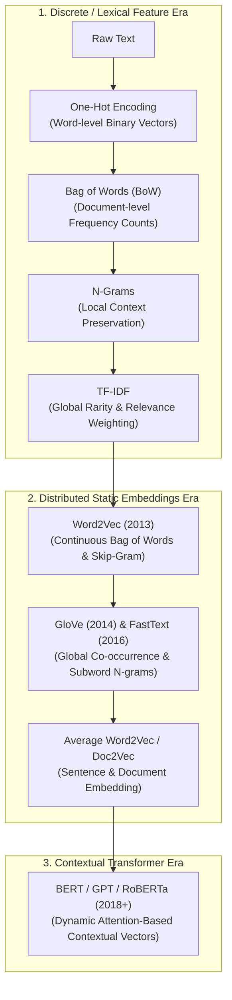
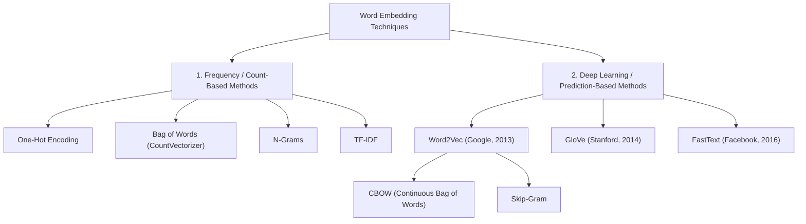
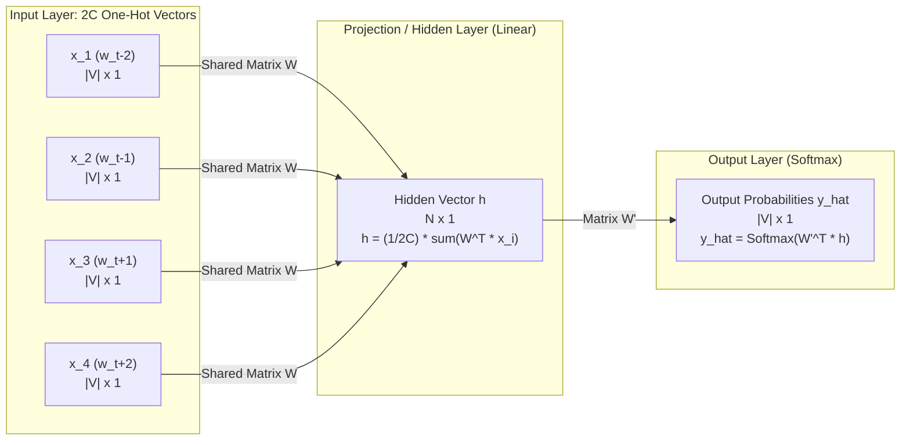
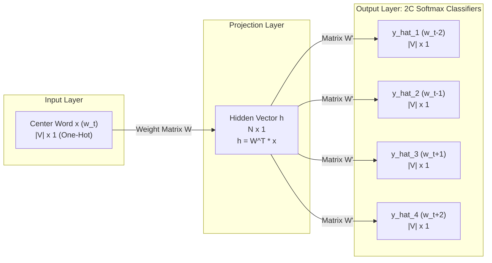

# Natural Language Processing: Text Vectorization & Word Embeddings Master Guide

> **Scope:** Comprehensive Theoretical Guide & Implementation Architecture (Feature Extraction, Sparse Vectorization, Distributed Word Embeddings, Word2Vec, CBOW, Skip-Gram, Average Word2Vec, and Gensim Practical Implementation)  
> **Target Audience:** Production ML Engineers, NLP Researchers, and Data Science Interview Candidates  
> **Key Objective:** Transform unstructured textual tokens into dense, semantically coherent mathematical representations suitable for machine learning and deep learning algorithms.

---

## Table of Contents
1. [The Grand Evolution of Vectorization](#1-the-grand-evolution-of-vectorization)
2. [One-Hot Encoding (OHE)](#2-one-hot-encoding-ohe)
   - [2.1 Mathematical Representation & Mental Model](#21-mathematical-representation--mental-model)
   - [2.2 Worked Numerical Example](#22-worked-numerical-example)
   - [2.3 Advantages & Critical Disadvantages](#23-advantages--critical-disadvantages)
3. [Bag of Words (BoW / Count Vectorizer)](#3-bag-of-words-bow--count-vectorizer)
   - [3.1 Intuition & End-to-End Pipeline](#31-intuition--end-to-end-pipeline)
   - [3.2 Binary BoW vs Count BoW](#32-binary-bow-vs-count-bow)
   - [3.3 Step-by-Step Worked Matrix Example](#33-step-by-step-worked-matrix-example)
   - [3.4 Advantages & Core Disadvantages](#34-advantages--core-disadvantages)
4. [N-Gram Language Modeling](#4-n-gram-language-modeling)
   - [4.1 Why Unigrams Fail: The Negation & Context Dilemma](#41-why-unigrams-fail-the-negation--context-dilemma)
   - [4.2 N-Gram Taxonomy: Unigram, Bigram, Trigram](#42-n-gram-taxonomy-unigram-bigram-trigram)
   - [4.3 Resolving Negation: Worked Mathematical Proof](#43-resolving-negation-worked-mathematical-proof)
   - [4.4 The Trade-Off: Context Resolution vs Combinatorial Explosion](#44-the-trade-off-context-resolution-vs-combinatorial-explosion)
5. [TF-IDF (Term Frequency – Inverse Document Frequency)](#5-tf-idf-term-frequency--inverse-document-frequency)
   - [5.1 The Information Retrieval Philosophy](#51-the-information-retrieval-philosophy)
   - [5.2 Mathematical Formulation & Formula Derivation](#52-mathematical-formulation--formula-derivation)
   - [5.3 Complete Step-by-Step Worked Example](#53-complete-step-by-step-worked-example)
   - [5.4 Advantages & Industry Limitations](#54-advantages--industry-limitations)
6. [Word Embeddings Taxonomy: The Paradigm Shift](#6-word-embeddings-taxonomy-the-paradigm-shift)
   - [6.1 Sparse Count-Based vs Dense Distributed Representations](#61-sparse-count-based-vs-dense-distributed-representations)
   - [6.2 The Geometric Mental Model: Proximity as Semantics](#62-the-geometric-mental-model-proximity-as-semantics)
7. [Word2Vec Core Foundations & Geometric Algebra](#7-word2vec-core-foundations--geometric-algebra)
   - [7.1 The Distributional Hypothesis & Latent Semantic Dimensions](#71-the-distributional-hypothesis--latent-semantic-dimensions)
   - [7.2 The Latent Feature Matrix & Conceptual Semantic Axes](#72-the-latent-feature-matrix--conceptual-semantic-axes)
   - [7.3 Famous Vector Arithmetic: $\mathbf{v}_{\text{King}} - \mathbf{v}_{\text{Man}} + \mathbf{v}_{\text{Woman}} \approx \mathbf{v}_{\text{Queen}}$](#73-famous-vector-arithmetic)
   - [7.4 Distance Metrics: Dot Product, Cosine Similarity, & Cosine Distance](#74-distance-metrics-dot-product-cosine-similarity--cosine-distance)
8. [Word2Vec Architectures: CBOW vs Skip-Gram](#8-word2vec-architectures-cbow-vs-skip-gram)
   - [8.1 The Context Window Mechanism](#81-the-context-window-mechanism)
   - [8.2 Continuous Bag of Words (CBOW) Architecture Deep Dive](#82-continuous-bag-of-words-cbow-architecture-deep-dive)
   - [8.3 Skip-Gram Architecture Deep Dive](#83-skip-gram-architecture-deep-dive)
   - [8.4 Mathematical Training Mechanics: Forward Pass, Softmax, & Loss](#84-mathematical-training-mechanics-forward-pass-softmax--loss)
   - [8.5 Efficient Training Hacks: Negative Sampling & Hierarchical Softmax](#85-efficient-training-hacks-negative-sampling--hierarchical-softmax)
   - [8.6 Architectural Showdown: When to Pick CBOW vs Skip-Gram](#86-architectural-showdown-when-to-pick-cbow-vs-skip-gram)
9. [Word2Vec Advantages & Technical Superiority](#9-word2vec-advantages--technical-superiority)
   - [9.1 Density vs Sparsity: Banishing Overfitting & Memory Bloat](#91-density-vs-sparsity-banishing-overfitting--memory-bloat)
   - [9.2 True Semantic & Analogical Capture](#92-true-semantic--analogical-capture)
   - [9.3 Decoupling Vector Dimensionality from Vocabulary Size](#93-decoupling-vector-dimensionality-from-vocabulary-size)
   - [9.4 Out-of-Vocabulary (OOV) Dynamics & Evolution to FastText](#94-out-of-vocabulary-oov-dynamics--evolution-to-fasttext)
10. [Average Word2Vec for Document Representations](#10-average-word2vec-for-document-representations)
    - [10.1 The Word-to-Document Aggregation Problem](#101-the-word-to-document-aggregation-problem)
    - [10.2 Mathematical Derivation of Centroid Vector](#102-mathematical-derivation-of-centroid-vector)
    - [10.3 TF-IDF Weighted Average Word2Vec](#103-tf-idf-weighted-average-word2vec)
    - [10.4 Pros, Cons, and Failure Modes](#104-pros-cons-and-failure-modes)
11. [Gensim Practical Implementation Guide](#11-gensim-practical-implementation-guide)
    - [11.1 Google News 300 Pre-trained Model](#111-google-news-300-pre-trained-model)
    - [11.2 Synonym Queries, Vector Geometry, & Analogical Inference](#112-synonym-queries-vector-geometry--analogical-inference)
    - [11.3 Training Custom Word2Vec Models from Scratch](#113-training-custom-word2vec-models-from-scratch)
12. [Master Feature Extraction Comparison Matrix](#12-master-feature-extraction-comparison-matrix)
13. [Top 25 Technical Interview Questions & Rigorous Answers](#13-top-25-technical-interview-questions--rigorous-answers)

---

## 1. The Grand Evolution of Vectorization

Machine learning algorithms (Logistic Regression, Support Vector Machines, Gradient Boosting Trees) and Deep Neural Networks operate strictly on numerical matrices and tensors. They cannot calculate dot products, gradients, or loss functions on raw character strings. Vectorization is the bridge between human symbolic language and linear algebra.



---

## 2. One-Hot Encoding (OHE)

### 2.1 Mathematical Representation & Mental Model
One-Hot Encoding assigns each unique token in the vocabulary $V$ a unique index $i \in \{1, 2, \dots, |V|\}$. A word is converted into a binary vector of dimension $|V|$, where only the $i$-th entry is `1` and all other $|V|-1$ entries are `0`.

$$\mathbf{v}(w_i) = [\underbrace{0, 0, \dots, 0}_{i-1 \text{ zeros}}, 1, \underbrace{0, \dots, 0}_{|V|-i \text{ zeros}}]^\top \in \{0, 1\}^{|V|}$$

### 2.2 Worked Numerical Example
Consider a toy corpus of three documents:
- $D_1$: `"the food is good"`
- $D_2$: `"the food is bad"`
- $D_3$: `"pizza is amazing"`

**Step 1: Extract the Vocabulary ($V$)**  
The distinct set of tokens across all documents is:
$$V = [\text{"the"}, \text{"food"}, \text{"is"}, \text{"good"}, \text{"bad"}, \text{"pizza"}, \text{"amazing"}], \quad |V| = 7$$

**Step 2: Construct the Word Vector Mapping**
- $\mathbf{v}(\text{"the"}) = [1, 0, 0, 0, 0, 0, 0]^\top$
- $\mathbf{v}(\text{"food"}) = [0, 1, 0, 0, 0, 0, 0]^\top$
- $\mathbf{v}(\text{"is"}) = [0, 0, 1, 0, 0, 0, 0]^\top$
- $\mathbf{v}(\text{"good"}) = [0, 0, 0, 1, 0, 0, 0]^\top$
- $\mathbf{v}(\text{"bad"}) = [0, 0, 0, 0, 1, 0, 0]^\top$
- $\mathbf{v}(\text{"pizza"}) = [0, 0, 0, 0, 0, 1, 0]^\top$
- $\mathbf{v}(\text{"amazing"}) = [0, 0, 0, 0, 0, 0, 1]^\top$

**Step 3: Document Matrix Representation**  
Document $D_1$ contains 4 tokens: `"the"`, `"food"`, `"is"`, `"good"`. Its one-hot encoded representation is a $4 \times 7$ matrix:
$$\mathbf{M}(D_1) = \begin{bmatrix}
1 & 0 & 0 & 0 & 0 & 0 & 0 \\
0 & 1 & 0 & 0 & 0 & 0 & 0 \\
0 & 0 & 1 & 0 & 0 & 0 & 0 \\
0 & 0 & 0 & 1 & 0 & 0 & 0
\end{bmatrix}_{4 \times 7}$$

For document $D_3$ (`"pizza is amazing"`), the matrix shape is $3 \times 7$:
$$\mathbf{M}(D_3) = \begin{bmatrix}
0 & 0 & 0 & 0 & 0 & 1 & 0 \\
0 & 0 & 1 & 0 & 0 & 0 & 0 \\
0 & 0 & 0 & 0 & 0 & 0 & 1
\end{bmatrix}_{3 \times 7}$$

### 2.3 Advantages & Critical Disadvantages

#### Advantages:
1. **Simple Implementation:** Easily produced using `sklearn.preprocessing.OneHotEncoder` or `pandas.get_dummies()`.
2. **Deterministic & Interpretable:** Every column maps directly to a human-readable vocabulary token.

#### Critical Disadvantages (Why OHE Fails for Text):
1. **Extreme Sparsity & High Dimensionality:** In real-world corpora, $|V| \ge 50,000$. Each token is represented by a vector of 49,999 zeros and a single one (sparsity $> 99.99\%$). This induces severe memory overhead and causes machine learning classifiers to overfit due to the **Curse of Dimensionality**.
2. **Non-Uniform Document Matrix Shapes:** Sentences have variable lengths. $D_1$ produces shape $(4, 7)$ while $D_3$ produces $(3, 7)$. Standard linear classifiers and tabular ML models require a **fixed-size feature vector** $(\mathbb{R}^d)$ per observation.
3. **Total Absence of Semantic Meaning (Orthogonality):** In linear algebra, the dot product between any two distinct one-hot vectors is identically zero:
   $$\mathbf{v}(w_i) \cdot \mathbf{v}(w_j) = 0 \quad (\forall i \neq j)$$
   $$\text{Cosine Similarity}(\mathbf{v}_{\text{food}}, \mathbf{v}_{\text{pizza}}) = \frac{\mathbf{v}_{\text{food}} \cdot \mathbf{v}_{\text{pizza}}}{\|\mathbf{v}_{\text{food}}\| \|\mathbf{v}_{\text{pizza}}\|} = \frac{0}{1 \cdot 1} = 0$$
   The model perceives `"food"` to be just as unrelated to `"pizza"` as it is to `"airplane"`.
4. **Out of Vocabulary (OOV) Paralysis:** Any word encountered during inference that was absent in training has no assigned index, causing the vectorization pipeline to fail or silently discard the token.

---

## 3. Bag of Words (BoW / Count Vectorizer)

### 3.1 Intuition & End-to-End Pipeline
The Bag-of-Words model discards token order, grammar, and syntax, treating each document as a container ("bag") of independent words. Instead of creating a matrix of shape $(\text{tokens} \times |V|)$, it aggregates word occurrences to generate a single **fixed-length vector of size $|V|$ for each entire document**.

```
Document: "good boy, good girl"
         │
         ▼
     [BoW Bag]
  "good" : 2
  "boy"  : 1
  "girl" : 1
         │
         ▼
Vector in R^|V|: [2, 1, 1, 0, 0, ...]
```

### 3.2 Binary BoW vs Count BoW
- **Count BoW (Standard):** The vector cell stores the raw term frequency: how many times word $w_j$ appears in document $D_i$.
- **Binary BoW:** The vector cell stores a binary indicator: $1$ if word $w_j$ is present in $D_i$, and $0$ otherwise, regardless of repetition count. Controlled in Scikit-Learn via `CountVectorizer(binary=True)`.

### 3.3 Step-by-Step Worked Matrix Example
Consider the cleaned corpus:
- $S_1$: `"good boy"`
- $S_2$: `"good girl"`
- $S_3$: `"boy girl good"`

**Step 1: Build the Vocabulary & Compute Frequencies**
- `"good"` appears in $S_1, S_2, S_3 \to \text{Frequency} = 3$
- `"boy"` appears in $S_1, S_3 \to \text{Frequency} = 2$
- `"girl"` appears in $S_2, S_3 \to \text{Frequency} = 2$

Sorted by descending frequency:
$$V = [\text{"good"}, \text{"boy"}, \text{"girl"}], \quad |V| = 3$$

**Step 2: Generate Document Vectors**

| Document | Raw Tokens | Feature 1 (`good`) | Feature 2 (`boy`) | Feature 3 (`girl`) | Output Vector $\mathbf{v} \in \mathbb{R}^3$ |
| :--- | :--- | :---: | :---: | :---: | :---: |
| $S_1$ | `['good', 'boy']` | $1$ | $1$ | $0$ | $[1, 1, 0]$ |
| $S_2$ | `['good', 'girl']` | $1$ | $0$ | $1$ | $[1, 0, 1]$ |
| $S_3$ | `['boy', 'girl', 'good']` | $1$ | $1$ | $1$ | $[1, 1, 1]$ |

If a fourth document $S_4$ were `"good good girl"`, its Count BoW vector would be $[2, 0, 1]$, whereas its Binary BoW vector would be $[1, 0, 1]$.

### 3.4 Advantages & Core Disadvantages

| Advantages | Core Disadvantages |
| :--- | :--- |
| **Fixed-Length Input:** Every document maps to a vector of uniform length $|V|$, solving the variable-shape constraint of OHE. | **Destruction of Word Order & Grammar:** Sentences with opposite meanings yield identical representations: `"not bad, is good"` vs `"not good, is bad"` map to identical bags. |
| **Effective for Keyword Classification:** Performs reliably as a baseline for Spam Filtering and Topical Document Categorization. | **High Dimensionality & Sparsity Persist:** If $|V| = 50,000$, a 10-word document contains 49,990 zeros. |
| **Frequency Weighting:** Tokens with high repetition receive proportionally higher numerical weight in linear models. | **Bias Towards Dominant Frequent Words:** Common domain terms drown out rare, highly informative keywords. |
| **Computational Simplicity:** Linear time complexity $O(N \cdot L)$ where $L$ is average document length. | **Out-of-Vocabulary (OOV) Blindness:** Unseen words are completely ignored during test inference. |

---

## 4. N-Gram Language Modeling

### 4.1 Why Unigrams Fail: The Negation & Context Dilemma
Standard Bag of Words treats individual words as unigrams ($N=1$). Consider these two reviews:
- $D_1$: `"the food is good"` $\to$ Positive Sentiment
- $D_2$: `"the food is not good"` $\to$ Negative Sentiment

Under a unigram BoW model (filtering out stopwords like `"the"`, `"is"`):
- Vocabulary: $V = [\text{"food"}, \text{"not"}, \text{"good"}]$
- $\mathbf{v}(D_1) = [1, 0, 1]^\top$
- $\mathbf{v}(D_2) = [1, 1, 1]^\top$

Computing Cosine Similarity:
$$\text{Cosine Similarity}(\mathbf{v}(D_1), \mathbf{v}(D_2)) = \frac{\mathbf{v}(D_1) \cdot \mathbf{v}(D_2)}{\|\mathbf{v}(D_1)\| \|\mathbf{v}(D_2)\|} = \frac{1(1) + 0(1) + 1(1)}{\sqrt{2} \cdot \sqrt{3}} = \frac{2}{\sqrt{6}} \approx 0.816$$

The model assesses these two polar opposite reviews as **$81.6\%$ identical** because they differ by only a single coordinate.

### 4.2 N-Gram Taxonomy: Unigram, Bigram, Trigram
An **N-gram** is a contiguous sequence of $N$ items from a given sample of text.
- **Unigram ($N=1$):** `["the", "food", "is", "good"]`
- **Bigram ($N=2$):** `["the food", "food is", "is good"]`
- **Trigram ($N=3$):** `["the food is", "food is good"]`

In Scikit-Learn's `CountVectorizer`, this is parameterized by `ngram_range=(min_n, max_n)`:
- `ngram_range=(1, 1)`: Pure Unigram BoW
- `ngram_range=(1, 2)`: Combination of Unigrams and Bigrams
- `ngram_range=(2, 2)`: Pure Bigrams

### 4.3 Resolving Negation: Worked Mathematical Proof
Constructing Bigrams on the two reviews:
- $D_1$: `"food good"` $\to$ Bigrams: `["food good"]`
- $D_2$: `"food not good"` $\to$ Bigrams: `["food not", "not good"]`

Combined Unigram + Bigram Vocabulary:
$$V = [\text{"food"}, \text{"good"}, \text{"not"}, \text{"food good"}, \text{"food not"}, \text{"not good"}], \quad |V| = 6$$

Generating the Vectors:
- $\mathbf{v}(D_1) = [1, 1, 0, 1, 0, 0]^\top$ (Magnitude: $\|\mathbf{v}(D_1)\| = \sqrt{3}$)
- $\mathbf{v}(D_2) = [1, 1, 1, 0, 1, 1]^\top$ (Magnitude: $\|\mathbf{v}(D_2)\| = \sqrt{5}$)

Recomputing Cosine Similarity:
$$\text{Cosine Similarity} = \frac{1(1) + 1(1) + 0(1) + 1(0) + 0(1) + 0(1)}{\sqrt{3} \cdot \sqrt{5}} = \frac{2}{\sqrt{15}} \approx \mathbf{0.516}$$

The mathematical similarity drops from **$0.816 \to 0.516$**. The presence of the explicit bigram feature `"not good"` gives downstream classifiers a direct, discriminative signal to separate negative sentiment from positive sentiment.

### 4.4 The Trade-Off: Context Resolution vs Combinatorial Explosion
While N-grams preserve local word ordering and context, the vocabulary size scales combinatorially with $N$:
$$|V_{\text{N-gram}}| \approx O(|V_{\text{unigram}}|^N)$$
If a unigram vocabulary has $|V| = 20,000$, a full bigram vocabulary can exceed $1,000,000$ features. In production, practitioners constrain the feature space using `max_features` or `min_df` (minimum document frequency threshold):
```python
from sklearn.feature_extraction.text import CountVectorizer
cv = CountVectorizer(ngram_range=(1, 2), max_features=10000)
```

---

## 5. TF-IDF (Term Frequency – Inverse Document Frequency)

### 5.1 The Information Retrieval Philosophy
Bag of Words assumes that the most frequent words in a document are the most important. In practice, words that appear frequently across *all* documents in a corpus (e.g., `"said"`, `"make"`, `"report"` in news articles) carry very little discriminative power. Conversely, a word that appears frequently in *one* document but is rare across the rest of the corpus (e.g., `"quarks"`, `"insulin"`, `"subpoena"`) is highly indicative of that document's specific topic.

**TF-IDF Formal Principle:**  
A term is important to document $d$ if it occurs frequently inside $d$ (**Term Frequency**), while occurring in very few other documents across the entire corpus (**Inverse Document Frequency**).

### 5.2 Mathematical Formulation & Formula Derivation

$$\text{TF-IDF}(t, d, D) = \text{TF}(t, d) \times \text{IDF}(t, D)$$

#### Component 1: Term Frequency (TF)
$$\text{TF}(t, d) = \frac{\text{Count of term } t \text{ in document } d}{\text{Total count of all terms in document } d} = \frac{f_{t,d}}{\sum_{t' \in d} f_{t',d}}$$

#### Component 2: Inverse Document Frequency (IDF)
$$\text{IDF}(t, D) = \ln\left(\frac{N}{\text{DF}(t)}\right)$$
Where:
- $N = |D|$: Total number of documents in the corpus.
- $\text{DF}(t)$: Document Frequency (the number of documents containing term $t$).

> [!NOTE]
> **Why the Logarithm?**  
> If $N = 1,000,000$ and a word appears in only $1$ document, the raw ratio $\frac{N}{\text{DF}}$ is $1,000,000$. If a word appears in $100$ documents, the ratio is $10,000$. Without a logarithm, the ratio would dominate the term frequency by orders of magnitude. The natural logarithm $\ln(x)$ compresses this dynamic range gracefully: $\ln(1,000,000) \approx 13.8$ vs $\ln(10,000) \approx 9.2$.

#### Standard Scikit-Learn Smooth Formulation:
To prevent division-by-zero when a word does not appear in training data, Scikit-Learn implements **smooth IDF**:
$$\text{IDF}_{\text{sklearn}}(t) = \ln\left(\frac{1 + N}{1 + \text{DF}(t)}\right) + 1$$
Followed by L2-normalization of each document vector:
$$\mathbf{v}_{\text{final}} = \frac{\mathbf{v}}{\|\mathbf{v}\|_2}$$

### 5.3 Complete Step-by-Step Worked Example
Consider our three cleaned documents:
- $S_1$: `"good boy"` (2 terms)
- $S_2$: `"good girl"` (2 terms)
- $S_3$: `"boy girl good"` (3 terms)
- Total Documents $N = 3$.

Vocabulary: $V = [\text{"good"}, \text{"boy"}, \text{"girl"}]$

#### Phase 1: Term Frequency Calculation ($\text{TF}$)

$$\begin{array}{|c|c|c|c|}
\hline
\textbf{Document} & \text{TF}(\text{"good"}) & \text{TF}(\text{"boy"}) & \text{TF}(\text{"girl"}) \\
\hline
S_1 & 1/2 = 0.500 & 1/2 = 0.500 & 0/2 = 0.000 \\
S_2 & 1/2 = 0.500 & 0/2 = 0.000 & 1/2 = 0.500 \\
S_3 & 1/3 \approx 0.333 & 1/3 \approx 0.333 & 1/3 \approx 0.333 \\
\hline
\end{array}$$

#### Phase 2: Inverse Document Frequency Calculation ($\text{IDF}$)
- $\text{"good"}$ appears in $S_1, S_2, S_3 \to \text{DF}(\text{"good"}) = 3$
  $$\text{IDF}(\text{"good"}) = \ln\left(\frac{3}{3}\right) = \ln(1) = \mathbf{0.000}$$
- $\text{"boy"}$ appears in $S_1, S_3 \to \text{DF}(\text{"boy"}) = 2$
  $$\text{IDF}(\text{"boy"}) = \ln\left(\frac{3}{2}\right) \approx \mathbf{0.405}$$
- $\text{"girl"}$ appears in $S_2, S_3 \to \text{DF}(\text{"girl"}) = 2$
  $$\text{IDF}(\text{"girl"}) = \ln\left(\frac{3}{2}\right) \approx \mathbf{0.405}$$

> [!IMPORTANT]
> Notice that $\text{IDF}(\text{"good"}) = 0$. Because `"good"` is ubiquitous across all documents, its information value is zero. It is automatically silenced without needing a manual stopword list.

#### Phase 3: Final Matrix Computation ($\text{TF} \times \text{IDF}$)

$$\begin{array}{|c|c|c|c|}
\hline
\textbf{Document} & \text{TF-IDF}(\text{"good"}) & \text{TF-IDF}(\text{"boy"}) & \text{TF-IDF}(\text{"girl"}) \\
\hline
S_1 & 0.5 \times 0 = \mathbf{0.000} & 0.5 \times 0.405 = \mathbf{0.2025} & 0 \times 0.405 = \mathbf{0.000} \\
S_2 & 0.5 \times 0 = \mathbf{0.000} & 0 \times 0.405 = \mathbf{0.000} & 0.5 \times 0.405 = \mathbf{0.2025} \\
S_3 & 0.333 \times 0 = \mathbf{0.000} & 0.333 \times 0.405 = \mathbf{0.1349} & 0.333 \times 0.405 = \mathbf{0.1349} \\
\hline
\end{array}$$

### 5.4 Advantages & Industry Limitations

| Advantages | Industry Limitations |
| :--- | :--- |
| **Statistical Noise Filtering:** Naturally penalizes ubiquitous corpus-wide words without manual dictionary curation. | **Still Orthogonal & Lexical:** Does not understand synonyms (`"physician"` vs `"doctor"` remain completely disjoint features). |
| **Domain Keyword Extraction:** Highly effective for Information Retrieval (Elasticsearch / Lucene algorithms rely heavily on BM25, an evolution of TF-IDF). | **Sparsity & Memory:** Remains a high-dimensional sparse matrix of shape $N \times |V|$. |
| **L2 Normalized Comparison:** Mitigates the bias where longer documents naturally accumulate higher raw word counts. | **Word Order Agnostic:** Word sequence and contextual syntactic grammar are completely ignored. |

---

## 6. Word Embeddings Taxonomy: The Paradigm Shift

### 6.1 Sparse Count-Based vs Dense Distributed Representations
All previous methods (One-Hot, BoW, N-Grams, TF-IDF) belong to the **Frequency / Count-Based Family**. They treat words as atomic, independent symbols.

In 2013, the field transitioned to **Distributed Dense Representations (Word Embeddings)**:

```
Discrete / Sparse World:
  "cat" = [0, 0, 0, 1, 0, 0, 0, 0, 0, 0, ...]  (Length: 50,000, 99.9% Zeros)
  "dog" = [0, 1, 0, 0, 0, 0, 0, 0, 0, 0, ...]  (Length: 50,000, 99.9% Zeros)
  Dot Product: "cat" · "dog" = 0.0

Continuous / Dense Embedding World:
  "cat" = [-0.12,  0.84, -0.45,  0.31, ...,  0.08]  (Length: 300, All Real Values)
  "dog" = [-0.10,  0.81, -0.42,  0.28, ...,  0.11]  (Length: 300, All Real Values)
  Cosine Similarity: "cat" · "dog" = 0.89  (High Semantic Affinity!)
```



### 6.2 The Geometric Mental Model: Proximity as Semantics
In dense vector space, semantic similarity is equivalent to **geometric distance**:
- Tokens sharing similar semantic functions cluster close together in vector space.
- Dissimilar or antonymous concepts are projected far apart.

```
                  ▲ Feature Dimension 2 (e.g., Emotional Valence)
                  │
      [happy] ●   │   ● [excited]
                  │
                  │
  ────────────────┼────────────────► Feature Dimension 1 (e.g., Arousal)
                  │
      [sad]   ●   │   ● [angry]
                  │
```
- The Euclidean distance $d(\text{happy}, \text{excited})$ is small; cosine similarity is near $1.0$.
- The distance $d(\text{happy}, \text{angry})$ is large; cosine similarity approaches $-1.0$ or $0.0$.

---

## 7. Word2Vec Core Foundations & Geometric Algebra

### 7.1 The Distributional Hypothesis & Latent Semantic Dimensions
Word2Vec is built on the famous linguistic principle formulated by J.R. Firth (1957):
> *"You shall know a word by the company it keeps."*

Words that appear in similar textual contexts tend to have similar meanings. Rather than counting global frequencies, Word2Vec trains a lightweight two-layer neural network to predict words from their context (or vice versa). In doing so, the network's hidden layer weights compress the entire vocabulary into a dense continuous space $\mathbb{R}^d$ (typically $d \in [100, 300]$).

### 7.2 The Latent Feature Matrix & Conceptual Semantic Axes
To conceptualize what the 300 dimensions represent, imagine an intuitive set of semantic latent axes:

| Latent Feature Axis | `boy` | `girl` | `king` | `queen` | `apple` | `mango` |
| :--- | :---: | :---: | :---: | :---: | :---: | :---: |
| **Gender (Male $\to$ Female)** | $-0.95$ | $+0.95$ | $-0.93$ | $+0.92$ | $+0.01$ | $+0.02$ |
| **Royalty / Status** | $+0.01$ | $+0.02$ | $+0.96$ | $+0.97$ | $-0.02$ | $-0.01$ |
| **Age / Maturity** | $+0.15$ | $+0.12$ | $+0.78$ | $+0.75$ | $+0.00$ | $+0.00$ |
| **Food / Edible Item** | $+0.01$ | $+0.00$ | $+0.02$ | $+0.01$ | $+0.94$ | $+0.95$ |
| **Color / Organic Shape**| $+0.02$ | $+0.01$ | $+0.03$ | $+0.02$ | $+0.65$ | $+0.70$ |

*Notice the geometric symmetries:*
- `"king"` and `"queen"` share near-identical Royalty coordinates ($+0.96 \approx +0.97$) but diverge sharply on the Gender axis ($-0.93$ vs $+0.92$).
- `"apple"` and `"mango"` cluster together on Food ($+0.94, +0.95$) while showing near-zero values on Royalty and Gender.

### 7.3 Famous Vector Arithmetic
Because the learned dimensions correspond to latent properties, Word2Vec supports **vector space linear algebra**:

$$\mathbf{v}_{\text{King}} - \mathbf{v}_{\text{Man}} + \mathbf{v}_{\text{Woman}} \approx \mathbf{v}_{\text{Queen}}$$

#### Mathematical Verification:
1. $\mathbf{v}_{\text{King}} - \mathbf{v}_{\text{Man}}$ strips the "male" component from royalty, isolating the abstract concept of **"Royalty / Monarch"**.
2. Adding $\mathbf{v}_{\text{Woman}}$ re-injects the "female" gender vector into the royalty concept.
3. The nearest vector in the 300-dimensional space to the resulting coordinate is $\mathbf{v}_{\text{Queen}}$.

Other classic geometric relationships captured:
- $\mathbf{v}_{\text{Paris}} - \mathbf{v}_{\text{France}} + \mathbf{v}_{\text{Italy}} \approx \mathbf{v}_{\text{Rome}}$ (Country $\to$ Capital)
- $\mathbf{v}_{\text{Bigger}} - \mathbf{v}_{\text{Big}} + \mathbf{v}_{\text{Small}} \approx \mathbf{v}_{\text{Smaller}}$ (Comparative grammar)
- $\mathbf{v}_{\text{Walking}} - \mathbf{v}_{\text{Walk}} + \mathbf{v}_{\text{Swim}} \approx \mathbf{v}_{\text{Swimming}}$ (Verb tense inflection)

### 7.4 Distance Metrics: Dot Product, Cosine Similarity, & Cosine Distance

Given two word vectors $\mathbf{u}, \mathbf{v} \in \mathbb{R}^d$:

#### 1. Dot Product:
$$\mathbf{u} \cdot \mathbf{v} = \sum_{i=1}^d u_i v_i = \|\mathbf{u}\| \|\mathbf{v}\| \cos(\theta)$$
*Drawback:* Confounded by vector magnitude. A word with high corpus frequency may develop larger weights, inflating the dot product without reflecting true semantic closeness.

#### 2. Cosine Similarity:
Measures the cosine of the angle $\theta$ between two vectors, completely independent of their lengths:
$$\text{Cosine Similarity}(\mathbf{u}, \mathbf{v}) = \frac{\mathbf{u} \cdot \mathbf{v}}{\|\mathbf{u}\|_2 \|\mathbf{v}\|_2} = \frac{\sum_{i=1}^d u_i v_i}{\sqrt{\sum_{i=1}^d u_i^2} \sqrt{\sum_{i=1}^d v_i^2}}$$
- Range: $[-1.0, +1.0]$
  - $\cos(\theta) = 1.0 \implies \theta = 0^\circ$ (Vectors point in identical directions; perfect synonyms)
  - $\cos(\theta) = 0.0 \implies \theta = 90^\circ$ (Orthogonal vectors; zero correlation)
  - $\cos(\theta) = -1.0 \implies \theta = 180^\circ$ (Diametrically opposite directions)

#### 3. Cosine Distance:
$$\text{Cosine Distance}(\mathbf{u}, \mathbf{v}) = 1 - \text{Cosine Similarity}(\mathbf{u}, \mathbf{v})$$
- Range: $[0.0, 2.0]$
  - Distance $= 0.0 \implies$ Identical meaning.
  - Distance $= 1.0 \implies$ Orthogonal / Unrelated.
  - Distance $= 2.0 \implies$ Complete diametrical opposition.

---

## 8. Word2Vec Architectures: CBOW vs Skip-Gram

Word2Vec is not a single model; it consists of two distinct architectures designed by Tomas Mikolov et al.:
1. **Continuous Bag of Words (CBOW):** Predicts the center target word given surrounding context words.
2. **Skip-Gram:** Predicts surrounding context words given a single center target word.

```
       CBOW                            Skip-Gram
   Context Words                      Target Word
  [ w(t-2), w(t-1) ]                     [ w(t) ]
  [ w(t+1), w(t+2) ]                        │
         │                                  ▼
         ▼                          [ Hidden Layer ]
  [ Hidden Layer ]                          │
  (Average Pooling)                         ▼
         │                            Context Words
         ▼                        [ w(t-2), w(t-1) ]
    Target Word                   [ w(t+1), w(t+2) ]
      [ w(t) ]
```

### 8.1 The Context Window Mechanism
Given the sentence:
$$\text{"Artificial intelligence is changing modern healthcare and medicine"}$$

With a window size parameter $C = 2$ (total window size $2C + 1 = 5$ tokens):
- Context words: `["Artificial", "intelligence", "changing", "modern"]`
- Center target word: `"is"`

Sliding the window forward by 1 token:
- Context words: `["intelligence", "is", "modern", "healthcare"]`
- Center target word: `"changing"`

### 8.2 Continuous Bag of Words (CBOW) Architecture Deep Dive



#### Step-by-Step Flow:
1. **Inputs:** $2C$ one-hot vectors $\mathbf{x}_1, \dots, \mathbf{x}_{2C} \in \{0, 1\}^{|V|}$.
2. **Input-to-Hidden Transformation:**  
   $W \in \mathbb{R}^{|V| \times N}$ is the input weight matrix, where $N$ is the embedding dimension (e.g., $N=300$). Multiplying $W^\top \mathbf{x}_i$ acts as an index lookup, retrieving the $N$-dimensional vector for word $i$.
3. **Average Pooling (The "Bag" Operation):**  
   The projection layer simply computes the average of the context embeddings without any non-linear activation function:
   $$\mathbf{h} = \frac{1}{2C} \sum_{i=1}^{2C} W^\top \mathbf{x}_i \in \mathbb{R}^N$$
4. **Hidden-to-Output Transformation:**  
   $W' \in \mathbb{R}^{N \times |V|}$ is the output embedding matrix. The network computes the raw logit scores for all $|V|$ vocabulary words:
   $$\mathbf{z} = {W'}^\top \mathbf{h} \in \mathbb{R}^{|V|}$$
5. **Softmax Output:**  
   $$\hat{y}_j = P(w_j \mid \text{context}) = \frac{\exp(z_j)}{\sum_{k=1}^{|V|} \exp(z_k)}$$

### 8.3 Skip-Gram Architecture Deep Dive



In Skip-Gram, the objective is reversed:
- Given the single center word $\mathbf{x}$, look up its embedding $\mathbf{h} = W^\top \mathbf{x}$.
- Use $\mathbf{h}$ to predict each of the $2C$ context words independently through $2C$ identical Softmax layers sharing the same output matrix $W'$.

### 8.4 Mathematical Training Mechanics: Forward Pass, Softmax, & Loss
The objective function for training is the categorical Cross-Entropy loss over the vocabulary:
$$\mathcal{L} = -\sum_{j=1}^{|V|} y_j \ln(\hat{y}_j)$$
Because $y$ is a one-hot vector representing the true target word $w^*$, the loss simplifies to:
$$\mathcal{L} = -\ln P(w^* \mid \text{context}) = -\ln\left(\frac{\exp(\mathbf{v}'_{w^*}^\top \mathbf{h})}{\sum_{k=1}^{|V|} \exp(\mathbf{v}'_{w_k}^\top \mathbf{h})}\right)$$
Using Stochastic Gradient Descent (SGD) or Adam, the gradients update both matrices $W$ and $W'$. Once training converges:
- **$W \in \mathbb{R}^{|V| \times N}$ is the final Word2Vec lookup table.** The $i$-th row of $W$ is the $N$-dimensional distributed embedding of word $w_i$.

### 8.5 Efficient Training Hacks: Negative Sampling & Hierarchical Softmax

#### The Computational Bottleneck:
Calculating the denominator of the standard Softmax requires summing over the entire vocabulary:
$$\sum_{k=1}^{|V|} \exp(\mathbf{v}'_{w_k}^\top \mathbf{h})$$
If $|V| = 1,000,000$, computing this gradient for *every single token of every sliding window across billions of words* is computationally intractable ($O(|V|)$ per step).

#### Solution 1: Negative Sampling (SGNS - Skip-Gram Negative Sampling)
Transforms a multi-class classification problem over $|V|$ classes into multiple binary logistic regression problems:
1. Treat the true target-context pair $(w_{\text{target}}, w_{\text{context}})$ as a **positive pair** (Label $= 1$).
2. Randomly sample $K$ "noise" words from the corpus according to a unigram frequency distribution (typically $K \in [5, 20]$ for small datasets, $K \in [2, 5]$ for massive corpora). Treat these as **negative pairs** (Label $= 0$).
3. The new objective function maximizes the probability of the true pair while minimizing the probability of the $K$ noise pairs:
   $$\mathcal{L}_{\text{NEG}} = \ln \sigma(\mathbf{v}'_{w_O}^\top \mathbf{v}_{w_I}) + \sum_{i=1}^K \mathbb{E}_{w_i \sim P_n(w)}\left[\ln \sigma(-\mathbf{v}'_{w_i}^\top \mathbf{v}_{w_I})\right]$$
4. **Computational Complexity drops from $O(|V|) \to O(K)$**, speeding up training by thousands of times.

#### Solution 2: Hierarchical Softmax
Replaces the flat $|V|$ Softmax layer with a Huffman binary tree where words are leaves. The probability of a word is the product of path probabilities from root to leaf. Reduces computation from $O(|V|) \to O(\log_2 |V|)$.

### 8.6 Architectural Showdown: When to Pick CBOW vs Skip-Gram

| Feature / Criterion | Continuous Bag of Words (CBOW) | Skip-Gram |
| :--- | :--- | :--- |
| **Prediction Task** | Context Words $\to$ Target Word | Target Word $\to$ Context Words |
| **Input Structure** | $2C$ Context Tokens | $1$ Target Token |
| **Output Structure** | $1$ Target Token | $2C$ Context Tokens |
| **Training Speed** | **Fast** ($3\times - 5\times$ faster than Skip-Gram) | **Slower** (computes multiple outputs per window) |
| **Frequent Words** | Performs exceptionally well on frequent terms | Strong, but can over-weight frequent co-occurrences |
| **Rare Words** | Poor; averages out rare word vectors with common context | **Superior**; treats each context pair independently |
| **Dataset Size** | Optimal for smaller to medium corpora | Optimal for massive datasets ($>10^8$ words) |
| **Averaging Effect** | Smooths representations across contexts | Retains distinct multiple contexts per word |

---

## 9. Word2Vec Advantages & Technical Superiority

### 9.1 Density vs Sparsity: Banishing Overfitting & Memory Bloat
- **BoW / TF-IDF Vector:** $50,000$ dimensions, $99.98\%$ zeros. High memory consumption, massive weight matrices in classifiers, high risk of overfitting on small training samples.
- **Word2Vec Vector:** $300$ dimensions, $100\%$ dense continuous values. Compact memory footprint ($50,000 \times 300 \times 4\text{ bytes} \approx 60\text{ MB}$), strong generalization, completely immune to the structural sparsity problem.

### 9.2 True Semantic & Analogical Capture
Unlike TF-IDF, Word2Vec organizes tokens geometrically according to semantic affinity. It natively solves:
- **Synonym Detection:** $\text{sim}(\text{"physician"}, \text{"doctor"}) \approx 0.88$
- **Antonym Identification:** Antonyms share similar context windows and appear as near-neighbors with opposing component signs.
- **Cross-category Analogies:** Encodes relational structures across geography, gender, syntax, and hierarchy.

### 9.3 Decoupling Vector Dimensionality from Vocabulary Size
In BoW/TF-IDF, adding $10,000$ new words to a corpus increases the vector dimensionality of *every single document* by $10,000$.  
In Word2Vec, the feature dimension $d$ is an invariant architectural hyperparameter (e.g., $d=300$). As the vocabulary grows from $100,000 \to 3,000,000$ words, document vector sizes remain strictly fixed at $300$.

### 9.4 Out-of-Vocabulary (OOV) Dynamics & Evolution to FastText
- **Word2Vec OOV Limitation:** Because Word2Vec assigns vectors to whole word tokens, it cannot produce an embedding for a novel word (e.g., typos like `"crickett"`, compound words, or unseen morphology).
- **Evolution to FastText (Facebook, 2016):** Built directly on Word2Vec Skip-Gram, but represents each word as a bag of **character n-grams** (e.g., for `"where"`, $n=3$: `<wh`, `whe`, `her`, `ere`, `re>`). A word vector is the sum of its character n-grams. When an OOV word appears, FastText sums its known subwords, solving the OOV barrier.

---

## 10. Average Word2Vec for Document Representations

### 10.1 The Word-to-Document Aggregation Problem
Word2Vec produces vectors for individual word tokens $\mathbf{v}_{w} \in \mathbb{R}^d$. However, downstream classification tasks (e.g., classifying a 50-word product review as Positive or Negative) require **a single vector for the entire document**.

```
Document D_i: ["food", "is", "amazing", "service", "great"]
                │       │        │          │         │
Word2Vec:      v_1     v_2      v_3        v_4       v_5   (Each in R^300)
                │       │        │          │         │
                └───────┴────────┼──────────┴─────────┘
                                 ▼
                     [ Average Pooling Layer ]
                                 ▼
                     v_doc = (1/5) * sum(v_i)          (Single vector in R^300!)
```

### 10.2 Mathematical Derivation of Centroid Vector
Let document $D$ contain $M$ recognized tokens $[w_1, w_2, \dots, w_M]$ present in the Word2Vec vocabulary. The document embedding $\mathbf{v}_{\text{doc}}$ is the arithmetic mean (centroid) of its constituent word vectors:

$$\mathbf{v}_{\text{doc}} = \frac{1}{M} \sum_{i=1}^M \mathbf{v}_{w_i} \in \mathbb{R}^d$$

#### Coordinate-Wise Interpretation:
For each dimension $k \in \{1, 2, \dots, d\}$:
$$(\mathbf{v}_{\text{doc}})_k = \frac{1}{M} \sum_{i=1}^M (\mathbf{v}_{w_i})_k$$
This produces a fixed-size $d$-dimensional embedding (e.g., $d=300$) for documents of arbitrary length, from a 3-word tweet to a 2,000-word essay.

### 10.3 TF-IDF Weighted Average Word2Vec
A naive arithmetic average treats common filler words with equal weight to informative keywords. To prioritize discriminative words, practitioners multiply each word vector by its corpus $\text{TF-IDF}$ weight:

$$\mathbf{v}_{\text{doc}}^{\text{TF-IDF}} = \frac{\sum_{i=1}^M \text{TF-IDF}(w_i, D) \cdot \mathbf{v}_{w_i}}{\sum_{i=1}^M \text{TF-IDF}(w_i, D)}$$

This ensures that rare, high-information tokens (`"glaucoma"`, `"fraud"`) dominate the document centroid, while frequent terms contribute minimally.

### 10.4 Pros, Cons, and Failure Modes

| Strengths | Limitations & Failure Modes |
| :--- | :--- |
| Produces a dense, compact $\mathbb{R}^{300}$ representation for any document length. | **Averaging Dilutes Information:** As document length increases ($>500$ words), the centroid vector drifts toward the corpus mean, washing out sharp thematic nuances. |
| Retains semantic topical similarity across documents. | **Word Order Blindness:** `"Dog bites man"` and `"Man bites dog"` produce identical document centroids. |
| Seamlessly plugs into standard classifiers (Logistic Regression, Random Forest, XGBoost). | **Negation Insensitivity:** Averaging `"movie is good"` and `"movie is not good"` yields near-identical vectors because only one coordinate sign shifts slightly. |

---

## 11. Gensim Practical Implementation Guide

### 11.1 Google News 300 Pre-trained Model
The pre-trained Google News model was trained by Google on a 100-billion-token news corpus using Skip-Gram with Negative Sampling:
- Vocabulary: $3,000,000$ unique words and phrases
- Vector Dimension: $300$
- Binary Model Size: $\approx 1.66\text{ GB}$

```python
import gensim.downloader as api

# 1. Download and load the pre-trained Google News 300-dimensional model
wv = api.load('word2vec-google-news-300')

# 2. Inspect vector dimensionality
print("Vector dimension:", wv['cricket'].shape)  # Output: (300,)
print("Raw vector snippet:", wv['cricket'][:5])   # First 5 dimensions
```

### 11.2 Synonym Queries, Vector Geometry, & Analogical Inference

```python
# A. Finding Top-N Semantically Similar Words (Nearest Neighbors by Cosine Similarity)
similar_to_cricket = wv.most_similar('cricket', topn=5)
for word, score in similar_to_cricket:
    print(f"{word:15s}: {score:.4f}")
# Output:
# cricketing      : 0.8372
# cricketers      : 0.8165
# Test_cricket    : 0.8094
# Twenty20        : 0.8068
# batsman         : 0.7954

# B. Solving Classic Vector Analogies: King - Man + Woman = ?
analogy_result = wv.most_similar(positive=['king', 'woman'], negative=['man'], topn=3)
for word, score in analogy_result:
    print(f"{word:15s}: {score:.4f}")
# Output:
# queen           : 0.7118
# monarch         : 0.6189
# princess        : 0.5902

# C. Pairwise Cosine Similarity Verification
sim_happy_glad = wv.similarity('happy', 'glad')
sim_happy_sad = wv.similarity('happy', 'sad')
print(f"Similarity('happy', 'glad'): {sim_happy_glad:.4f}")  # ~0.74
print(f"Similarity('happy', 'sad') : {sim_happy_sad:.4f}")   # ~0.53

# D. Detecting the Outlier ("Does Not Match")
outlier = wv.doesnt_match(["apple", "banana", "mango", "car"])
print("Outlier token:", outlier)  # Output: 'car'
```

### 11.3 Training Custom Word2Vec Models from Scratch
When working in specialized technical domains (biomedical, legal, finance), pre-trained Google News vectors perform poorly on proprietary terminology. You can train a custom Word2Vec model on your own tokenized corpus:

```python
from gensim.models import Word2Vec

# Tokenized list of sentences
sentences = [
    ["artificial", "intelligence", "transforms", "healthcare", "diagnostics"],
    ["machine", "learning", "algorithms", "predict", "patient", "outcomes"],
    ["deep", "learning", "neural", "networks", "detect", "medical", "anomalies"],
    ["healthcare", "providers", "adopt", "machine", "learning", "systems"]
]

# Train the Word2Vec model
custom_model = Word2Vec(
    sentences=sentences,
    vector_size=100,      # Embedding dimension (d = 100)
    window=5,             # Context window (C = 2 forward + 2 backward)
    min_count=1,          # Minimum token frequency threshold
    sg=0,                 # Architecture: 0 = CBOW, 1 = Skip-Gram
    workers=4,            # Multi-threading CPU cores
    epochs=10             # Training iterations over corpus
)

# Extract embedding for custom word
print("Embedding shape:", custom_model.wv['healthcare'].shape)  # (100,)
print("Similar terms:", custom_model.wv.most_similar('machine', topn=2))
```

---

## 12. Master Feature Extraction Comparison Matrix

| Evaluation Dimension | One-Hot Encoding | Bag of Words (BoW) | N-Grams | TF-IDF | Word2Vec (CBOW / Skip-Gram) | Average Word2Vec |
| :--- | :--- | :--- | :--- | :--- | :--- | :--- |
| **Representation Level** | Token / Word | Entire Document | Entire Document | Entire Document | Token / Word | Entire Document |
| **Vector Space Type** | Discrete Sparse | Discrete Sparse | Discrete Sparse | Continuous Sparse | Continuous **Dense** | Continuous **Dense** |
| **Output Dimensionality** | $|V|$ per token | $|V|$ per document | $|V_{N}|$ (Huge) | $|V|$ per document | $d \in [100, 300]$ (Fixed) | $d \in [100, 300]$ (Fixed) |
| **Sparsity Rate** | $> 99.9\%$ zeros | High ($> 95\%$) | Extremely High | High ($> 95\%$) | **$0\%$ (100% Real values)** | **$0\%$ (100% Real values)** |
| **Semantic Similarity** | ❌ Orthogonal ($0.0$) | ❌ Weak | ❌ Weak | ❌ Weak | ✅ **High (Cosine metric)** | ✅ High (Topic Centroid) |
| **Word Order Sensitivity** | Sequence-dependent | ❌ Completely lost | ✅ Local context | ❌ Completely lost | Context window only | ❌ Averaged out |
| **Out-of-Vocabulary (OOV)** | ❌ Complete failure | ❌ Silent discard | ❌ Silent discard | ❌ Silent discard | ❌ Fails on unseen tokens | ❌ Skips unseen tokens |
| **Computational Footprint**| Low | Low | Moderate to High | Low to Moderate | High training / Low inference | Low inference |
| **Ideal Downstream Model** | Categorical Encoding | Logistic Regression / Naive Bayes | Naive Bayes / SVM | Linear SVM / Logistic Regression | Neural Networks (Embedding layer) | XGBoost / Random Forest / SVM |

---

## 13. Top 25 Technical Interview Questions & Rigorous Answers

#### Q1: Why is One-Hot Encoding impractical for representing text documents in machine learning?
**Answer:** OHE suffers from three fatal issues: (1) **High Sparsity & Memory Bloat:** With a vocabulary $|V| = 100,000$, each word vector is $99.999\%$ zeros, causing the Curse of Dimensionality and classifier overfitting. (2) **Variable Matrix Shapes:** Sentences have variable token lengths, yielding matrices of varying rows that standard ML algorithms cannot process. (3) **Orthogonality:** The dot product between any two distinct one-hot vectors is strictly zero, destroying all semantic relationships.

#### Q2: What is the core difference between Count Bag of Words and Binary Bag of Words?
**Answer:** Count BoW stores the absolute frequency of a word in a document ($f_{t,d} \in \{0, 1, 2, \dots\}$), reflecting term intensity. Binary BoW records only binary occurrence ($x \in \{0, 1\}$), dampening the influence of repeated words. Binary BoW is often preferred in sentiment analysis or short texts where repeated mentions do not indicate additional importance.

#### Q3: How do N-Grams solve the negation problem in sentiment analysis?
**Answer:** Unigram models split `"not good"` into `"not"` and `"good"`. The positive token `"good"` often masks the negative sentiment. By joining adjacent tokens into bigrams (`"not_good"`), the model captures the inverted polarity as a dedicated feature with its own distinct weight in the linear classifier.

#### Q4: Why is the logarithm used in the Inverse Document Frequency (IDF) formula?
**Answer:** The raw document frequency ratio $\frac{N}{\text{DF}(t)}$ can vary wildly (e.g., from $1$ to $10,000,000$). The natural logarithm compresses this exponential scale into a stable linear range ($\ln(10^7) \approx 16.1$), preventing words that appear only once from completely overwhelming term frequency values.

#### Q5: If a word appears in every single document in a corpus, what is its standard TF-IDF score?
**Answer:** Exactly **$0$**. Under the standard definition $\text{IDF} = \ln\left(\frac{N}{\text{DF}}\right)$, when $\text{DF} = N$, $\text{IDF} = \ln(1) = 0$. Consequently, $\text{TF} \times 0 = 0$. TF-IDF naturally eliminates universal corpus words without requiring a pre-built stopword list.

#### Q6: What is the Distributional Hypothesis in modern NLP?
**Answer:** Formulated by linguist J.R. Firth in 1957 (*"You shall know a word by the company it keeps"*), it posits that words occurring in similar contexts share similar semantic meanings. This hypothesis forms the entire theoretical basis for Word2Vec, GloVe, and modern Transformer embeddings.

#### Q7: What is the difference between sparse word representations and distributed word representations?
**Answer:** A sparse representation (One-Hot, BoW) dedicates a single distinct dimension to each word in isolation, resulting in high dimensionality and zero semantic overlap. A distributed representation (Word2Vec) represents each word across $d$ shared continuous latent dimensions (where $d \ll |V|$), meaning concept semantics are distributed across the entire vector.

#### Q8: Walk through the architectural differences between CBOW and Skip-Gram.
**Answer:** CBOW takes $2C$ context words as input, averages their input embeddings in a linear projection layer, and predicts the single center target word. Skip-Gram takes a single center target word as input and projects it through an embedding layer to predict the probability distribution of each of the $2C$ surrounding context words independently.

#### Q9: Why is the projection layer in Word2Vec CBOW linear without an activation function?
**Answer:** The projection layer performs simple vector addition and averaging ($\mathbf{h} = \frac{1}{2C} \sum W^\top \mathbf{x}_i$). Omitting non-linear activation functions (like ReLU or Sigmoid) reduces computational complexity, allows the network to train via pure linear matrix multiplication, and ensures that the hidden weights directly correspond to standard Euclidean vector spaces.

#### Q10: Why does Skip-Gram perform better than CBOW on rare words?
**Answer:** In CBOW, context word vectors are averaged together before predicting the target word. When a rare word appears in the context, its contribution is diluted by the surrounding common words. In Skip-Gram, each context word is predicted independently against the target word; hence, a rare target word receives full, undiluted gradient updates during backpropagation.

#### Q11: Explain the mathematical intuition of Negative Sampling (SGNS).
**Answer:** Standard Softmax requires computing the normalization term $\sum_{k=1}^{|V|} \exp(\mathbf{v}'_k^\top \mathbf{h})$, which has $O(|V|)$ cost per step. Negative Sampling replaces this with $K+1$ binary logistic regressions: it maximizes the sigmoid probability $\sigma(\mathbf{v}'_{\text{true}}^\top \mathbf{h})$ for the true co-occurring word, while minimizing $\sigma(\mathbf{v}'_{\text{noise}}^\top \mathbf{h})$ for $K$ randomly sampled negative tokens. This reduces complexity from $O(|V|) \to O(K)$.

#### Q12: How are negative samples selected in Word2Vec Negative Sampling?
**Answer:** Negative samples are drawn from the unigram frequency distribution raised to the $3/4$ power (the **Unigram $3/4$ Distribution**):
$$P_n(w) = \frac{U(w)^{0.75}}{\sum_{w'} U(w')^{0.75}}$$
Raising frequencies to the $0.75$ power dampens the dominance of extremely frequent stopwords while boosting the sampling probability of rare words.

#### Q13: What is the relationship between Cosine Similarity and Cosine Distance?
**Answer:** $\text{Cosine Distance} = 1 - \text{Cosine Similarity}$. While Cosine Similarity measures directional alignment from $-1$ (opposite) to $+1$ (identical), Cosine Distance acts as a proper dissimilarity metric from $0$ (identical) to $2$ (diametrically opposite).

#### Q14: Why do we use Cosine Similarity instead of Euclidean Distance to compare word embeddings?
**Answer:** Euclidean distance is sensitive to vector magnitude (length). In word embeddings, vector magnitude is often influenced by token frequency rather than core semantic meaning. Cosine similarity normalizes vector lengths to $1.0$, evaluating purely the directional angle $\theta$ in latent space.

#### Q15: How do you represent an entire paragraph or document using Word2Vec?
**Answer:** Using **Average Word2Vec**: take all recognized words in the document, retrieve their individual $d$-dimensional Word2Vec vectors, and compute their arithmetic mean vector $\mathbf{v}_{\text{doc}} = \frac{1}{M} \sum_{i=1}^M \mathbf{v}_{w_i}$. Alternatively, weight each word vector by its corpus TF-IDF score before averaging.

#### Q16: What is the primary limitation of Average Word2Vec for document classification?
**Answer:** (1) **Information Dilution:** Averaging hundreds of vectors causes the centroid to drift toward a generic mean, obscuring fine-grained topical details. (2) **Complete Loss of Syntax:** Averaging ignores word order and syntactic dependency structures.

#### Q17: What are the two weight matrices in Word2Vec, and which one is retained as the final word embedding?
**Answer:** Word2Vec learns an Input Matrix $W \in \mathbb{R}^{|V| \times N}$ and an Output Matrix $W' \in \mathbb{R}^{N \times |V|}$. Almost universally, the input matrix $W$ is retained as the lookup table of word vectors, where row $i$ represents word $w_i$. (Some researchers average $W$ and $W'^\top$, but using $W$ alone is standard).

#### Q18: What is the impact of context window size $C$ on learned Word2Vec embeddings?
**Answer:**  
- **Small Windows ($C = 2$):** Capture **syntactic / functional similarity**. Words that swap grammatically (e.g., adjectives, parts of speech) cluster together.
- **Large Windows ($C = 5 \text{ to } 10$):** Capture **broad topical / semantic similarity**. Words related to the same broad domain (e.g., `"hospital"`, `"doctor"`, `"scalpel"`, `"surgery"`) cluster together regardless of part-of-speech.

#### Q19: How does FastText improve upon Word2Vec?
**Answer:** FastText breaks each word down into a bag of **character n-grams** (e.g., `"apple"` $\to$ `<ap`, `app`, `ppl`, `ple`, `le>`) and learns representations for the n-grams. The word vector is the sum of its character n-gram embeddings. This allows FastText to capture morphological prefixes/suffixes and produce meaningful vectors for Out-Of-Vocabulary (OOV) words and typos.

#### Q20: Can Word2Vec handle Polysemy (words with multiple meanings, like "bank" or "apple")?
**Answer:** **No.** Word2Vec assigns exactly **one static vector** to each word string in the vocabulary. The vector for `"bank"` is forced to become a compromise blend of river banks and financial institutions. Solving polysemy requires **Contextual Embeddings** (like BERT or ELMo), which generate dynamic vectors based on the entire surrounding sentence.

#### Q21: What is the difference between Word2Vec and GloVe?
**Answer:** Word2Vec is a **predictive** model that iterates over local sliding windows using stochastic gradient descent. GloVe (Global Vectors, Stanford) is a **count-based matrix factorization** model that constructs a global word co-occurrence matrix across the entire corpus and optimizes a log-bilinear model to fit global co-occurrence probabilities.

#### Q22: What happens if you do not remove stopwords before training a Word2Vec model?
**Answer:** Frequent stopwords (`"the"`, `"is"`, `"at"`) appear in almost every context window, acting as noise that slows down training and degrades semantic differentiation. Word2Vec mitigates this using **subsampling of frequent words**: words with frequency $f(w) > t$ are randomly discarded during window generation with probability $P(w) = 1 - \sqrt{\frac{t}{f(w)}}$.

#### Q23: Why does Word2Vec King - Man + Woman equal Queen work mathematically?
**Answer:** The objective function forces word relationships to be encoded as linear vector translations. The direction and distance from $\mathbf{v}_{\text{Man}}$ to $\mathbf{v}_{\text{Woman}}$ encodes the concept of gender transition. Adding that exact directional displacement to $\mathbf{v}_{\text{King}}$ lands in the coordinate neighborhood of $\mathbf{v}_{\text{Queen}}$.

#### Q24: How does Min Count (`min_count`) affect Word2Vec training in Gensim?
**Answer:** Words appearing fewer times than `min_count` are pruned from the vocabulary before training begins. This removes typos, rare noise, and tokens with insufficient context to learn meaningful representations, drastically reducing model size and training time.

#### Q25: When would you choose TF-IDF over Word2Vec in production?
**Answer:** Choose TF-IDF when: (1) The dataset is very small ($<5,000$ documents), where Word2Vec cannot learn meaningful embeddings from scratch. (2) Computing resources or latency constraints are extreme. (3) The task relies purely on specific keywords (e.g., legal document retrieval, exact SKU search). Choose Word2Vec when the task requires understanding synonyms, thematic context, or capturing analogies across unstructured text.
