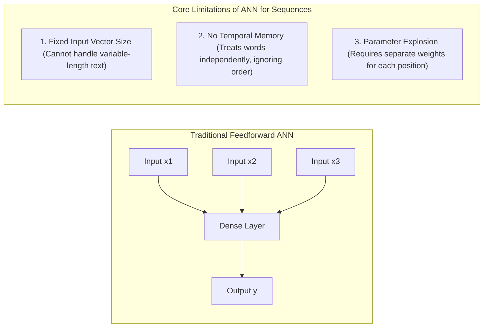
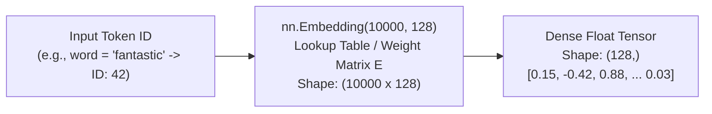
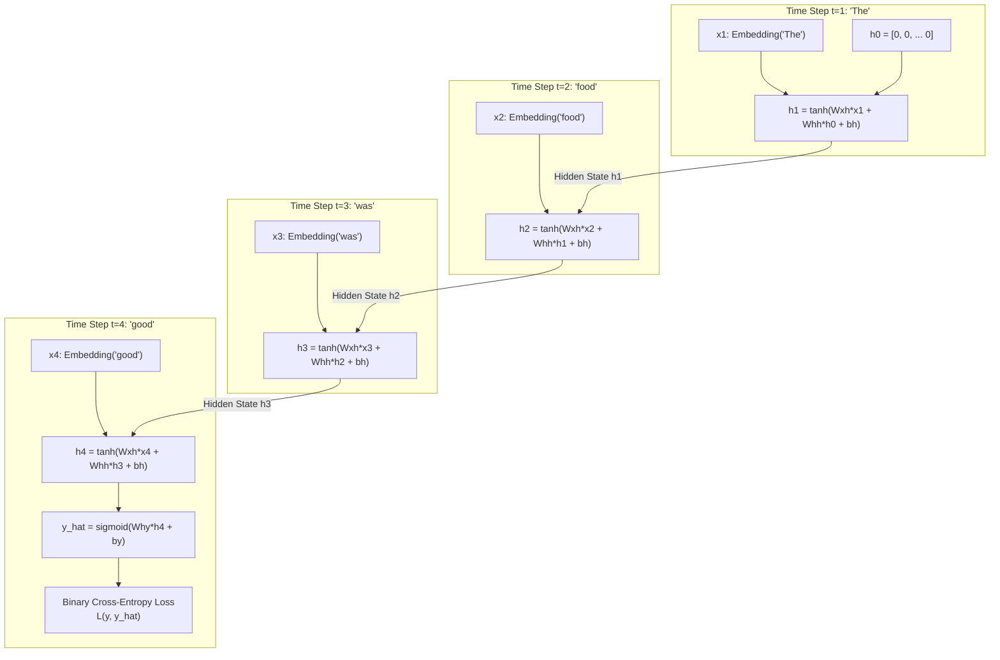
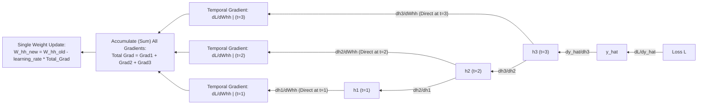

# Recurrent Neural Networks (Simple RNN) & Word Embeddings
### A Comprehensive, Visual & Mathematical Guide from First Principles

---

## 1. Why Standard Artificial Neural Networks (ANNs) Fail on Sequential Data

Before diving into Recurrent Neural Networks (RNNs), we must understand why traditional Feedforward Neural Networks (ANNs/MLPs) cannot effectively model sequential text, audio, or time-series data.



### The Three Critical Limitations:
1. **Fixed Input & Output Dimensions**: An MLP requires a fixed-size input vector (e.g., exactly 500 features). But sentences have arbitrary lengths—one sentence has 4 words, another has 40. Truncating or padding heavily wastes memory and distorts context.
2. **Lack of Temporal Memory (Word Order Blindness)**: In feedforward networks, inputs are processed independently. However, in natural language, **word order completely changes the meaning**:
   - *"The food was not good, it was bad."* (Negative)
   - *"The food was not bad, it was good."* (Positive)
   A bag-of-words or static MLP sees identical word counts in both sentences and predicts the same sentiment.
3. **No Parameter Sharing Across Temporal Positions**: If an ANN learns that the word *"terrible"* at position 1 indicates negative sentiment, it cannot generalize that knowledge if *"terrible"* appears at position 15, because position 1 and position 15 are connected to completely distinct weight matrices.

---

## 2. Simple RNN Architecture: Rolled vs. Unrolled

A **Recurrent Neural Network (RNN)** solves these problems by introducing a **feedback loop (recurrent connection)**. At each time step $t$, the network takes both the current input $x_t$ and the **previous hidden state** $h_{t-1}$ (the memory of all past tokens).

### 2.1 The Visual Representation

Here is how an RNN is represented—first in its compact "rolled" form, and then "unrolled" across time steps:


*Figure 1: The compact "rolled" RNN. The loop passes the hidden state back into the module for the next time step.*


*Figure 2: The RNN unrolled across time steps ($t=0, 1, \dots, t$). Notice that each time step receives the hidden state from the previous step.*


*Figure 3: Unfolding showing the three fundamental shared weight matrices: $U$ ($W_{xh}$), $W$ ($W_{hh}$), and $V$ ($W_{hy}$). Source: Wikimedia Commons.*

---

### 2.2 The Anatomy of a Simple RNN Cell

Inside each RNN cell, the current input vector $x_t$ and the previous hidden state vector $h_{t-1}$ are linearly combined, shifted by a bias vector, and passed through an activation function (typically $\tanh$):


*Figure 4: Inside a standard Simple RNN cell. The previous hidden state $h_{t-1}$ and current input $x_t$ are combined via $\tanh$ to produce the new hidden state $h_t$.*

### 2.3 The Fundamental Equations of Simple RNN

At any time step $t \in \{1, 2, \dots, T\}$:

1. **Hidden State Update**:
   $$h_t = \tanh\left( W_{xh} x_t + W_{hh} h_{t-1} + b_h \right)$$

2. **Output / Prediction**:
   - For **Sequence-to-Sequence (Many-to-Many)** tasks (e.g., POS tagging, language modeling):
     $$\hat{y}_t = \sigma\left( W_{hy} h_t + b_y \right)$$
   - For **Sequence-to-Vector (Many-to-One)** tasks (e.g., IMDB Sentiment Classification):
     We discard intermediate outputs and use only the **final hidden state** $h_T$:
     $$\hat{y} = \sigma\left( W_{hy} h_T + b_y \right)$$

Where:
* $x_t \in \mathbb{R}^{d}$: Input feature vector at time step $t$ ($d =$ embedding dimension).
* $h_t \in \mathbb{R}^{m}$: Hidden state vector at time step $t$ ($m =$ hidden state dimension / number of RNN units).
* $h_{t-1} \in \mathbb{R}^{m}$: Hidden state vector from previous time step ($h_0 = \vec{0}$).
* $W_{xh} \in \mathbb{R}^{m \times d}$: Weight matrix transforming input $x_t$ into the hidden space.
* $W_{hh} \in \mathbb{R}^{m \times m}$: **Recurrent weight matrix** transforming previous state $h_{t-1}$ into the current state.
* $b_h \in \mathbb{R}^{m}$: Bias vector for the hidden state.
* $W_{hy} \in \mathbb{R}^{k \times m}$: Output weight matrix transforming hidden state $h_t$ to output space ($k =$ number of classes, $k=1$ for binary classification).
* $b_y \in \mathbb{R}^{k}$: Bias vector for the output layer.
* $\tanh$: Hyperbolic tangent activation function, squashing values to $[-1, 1]$.
* $\sigma$: Sigmoid activation function, producing probabilities in $[0, 1]$.

---

## 3. Demystifying Word Embedding Layers in Deep Learning

In traditional NLP, we used sparse, high-dimensional vectors like One-Hot Encoding ($V = 10,000$ dimensions where every word is orthogonal). In deep learning, an **Embedding Layer (`nn.Embedding` in PyTorch)** maps discrete token IDs into dense, low-dimensional, continuous vector representations ($d = 64$ or $128$).



### What `nn.Embedding` Actually Does:
1. `nn.Embedding(vocab_size, embedding_dim)` is **not a dense neural network layer with biases or activations**.
2. It is simply a **trainable lookup table matrix** $E \in \mathbb{R}^{V \times d}$:
   - Each row $i$ in $E$ corresponds to the embedding vector of word index $i$.
3. When you pass an integer tensor of token IDs `[4, 18, 92]`, PyTorch simply slices rows 4, 18, and 92 from the matrix $E$:
   $$\text{Embedding}(\text{ID}_i) = E[\text{ID}_i, :]$$
4. **During Training**: The values in $E$ are updated via gradient descent just like any other weight matrix! Over time, words appearing in similar contexts develop similar embedding vectors.

---

## 4. Forward Propagation Through Time: A Concrete Walkthrough

Let us trace the forward pass through time using a concrete sentiment example:
**Review**: *"The food was good"* $\to$ 4 time steps ($T=4$).



### Numerical Trace:
* **Initial State**: $h_0 = \mathbf{0}$.
* **$t=1$**: $h_1 = \tanh(W_{xh} x_1 + W_{hh} h_0 + b_h)$.
  $h_1$ encodes information about *"The"*.
* **$t=2$**: $h_2 = \tanh(W_{xh} x_2 + W_{hh} h_1 + b_h)$.
  $h_2$ encodes information about *"The food"*.
* **$t=3$**: $h_3 = \tanh(W_{xh} x_3 + W_{hh} h_2 + b_h)$.
  $h_3$ encodes information about *"The food was"*.
* **$t=4$**: $h_4 = \tanh(W_{xh} x_4 + W_{hh} h_3 + b_h)$.
  $h_4$ is the **final summary context vector** representing the entire sentence *"The food was good"*.
* **Prediction**: $\hat{y} = \sigma(W_{hy} h_4 + b_y)$.
* **Loss**: $L = -(y \log(\hat{y}) + (1-y)\log(1-\hat{y}))$.

---

## 5. Deep Dive: Backpropagation Through Time (BPTT) & The Shared Weight Update

> ### ⚠️ Addressing the Fundamental Confusion:
> *"When we perform backpropagation in an RNN, is the derivative of the loss with respect to a weight calculated only once and then that same value is used to update every neuron?"*

**The short answer**: **No. That is not how RNN backpropagation works.**

Let us dismantle this confusion completely and explain exactly how BPTT functions from mathematical first principles.

---

### 5.1 The Core Conceptual Reality: Only ONE Weight Exists

First, understand the physical structure:
* In an RNN, there are **no separate neurons or copies of weights across time**.
* There is only **ONE single weight matrix $W_{hh}$**, **ONE matrix $W_{xh}$**, and **ONE matrix $W_{hy}$** stored in memory.
* When we draw the "unrolled" RNN across $t=1, t=2, t=3$, we are **not** showing multiple physical layers. We are showing the **same single physical layer applied repeatedly across sequential moments in time**.

```
Physical Reality (1 Cell):
+-------------------------------+
|                               |
|   x_t ---> [ RNN Cell ] ----> | (Loop back to itself)
|                 |             |
|                 +-- W_hh -----+
+-------------------------------+

Unrolled Computational Graph (Temporal Unfolding):
Step t=1            Step t=2            Step t=3
[ RNN ] --W_hh-->   [ RNN ] --W_hh-->   [ RNN ] ---> Output ---> Loss
  ^                   ^                   ^
  |                   |                   |
 x_1                 x_2                 x_3
```

Because the **exact same matrix $W_{hh}$** was reused at step 1, step 2, and step 3, changing $W_{hh}$ by a tiny delta $\Delta W$ will affect the loss **through multiple distinct computational pathways**:
1. It affects $L$ via its action at $t=3$.
2. It affects $L$ via its action at $t=2$ (which changed $h_2$, which in turn changed $h_3$, which changed $L$).
3. It affects $L$ via its action at $t=1$ (which changed $h_1 \to h_2 \to h_3 \to L$).

---

### 5.2 The Multivariate Chain Rule: Summing Over Temporal Contributions

By the **multivariate chain rule of calculus**, when a parameter $W$ influences a function $L$ through multiple independent paths, the **total derivative is the SUM of the derivatives along all pathways**:

$$\frac{\partial L}{\partial W_{hh}} = \sum_{t=1}^{T} \left. \frac{\partial L}{\partial W_{hh}} \right|_{(t)}$$

where $\left. \frac{\partial L}{\partial W_{hh}} \right|_{(t)}$ denotes the gradient contribution originating from the weight's usage at time step $t$.



---

### 5.3 Mathematical Step-by-Step Derivation of BPTT

Consider a 3-step unrolled sequence ($T=3$) where the loss $L$ is computed at the final step $t=3$:

#### 1. Updating the Output Weight $W_{hy}$:
$W_{hy}$ only connects the final hidden state $h_3$ to the output $\hat{y}$. Therefore, it is used only once:
$$\frac{\partial L}{\partial W_{hy}} = \frac{\partial L}{\partial \hat{y}} \cdot \frac{\partial \hat{y}}{\partial z_3} \cdot \frac{\partial z_3}{\partial W_{hy}} = (\hat{y} - y) \cdot h_3^T$$

#### 2. Updating the Recurrent Weight $W_{hh}$:
Now let us compute $\frac{\partial L}{\partial W_{hh}}$. Since $W_{hh}$ influences $h_3$ directly, but also influenced $h_2$ and $h_1$:

**At $t=3$ (Direct pathway)**:
$$\left. \frac{\partial L}{\partial W_{hh}} \right|_{(t=3)} = \frac{\partial L}{\partial h_3} \cdot \frac{\partial h_3}{\partial W_{hh}}$$

**At $t=2$ (Pathway through $h_2$)**:
$$\left. \frac{\partial L}{\partial W_{hh}} \right|_{(t=2)} = \frac{\partial L}{\partial h_3} \cdot \frac{\partial h_3}{\partial h_2} \cdot \frac{\partial h_2}{\partial W_{hh}}$$

**At $t=1$ (Pathway through $h_1$)**:
$$\left. \frac{\partial L}{\partial W_{hh}} \right|_{(t=1)} = \frac{\partial L}{\partial h_3} \cdot \frac{\partial h_3}{\partial h_2} \cdot \frac{\partial h_2}{\partial h_1} \cdot \frac{\partial h_1}{\partial W_{hh}}$$

#### 3. Accumulating into the Total Gradient:
$$\frac{\partial L}{\partial W_{hh}} = \left. \frac{\partial L}{\partial W_{hh}} \right|_{(t=3)} + \left. \frac{\partial L}{\partial W_{hh}} \right|_{(t=2)} + \left. \frac{\partial L}{\partial W_{hh}} \right|_{(t=1)}$$

In general, for a sequence of length $T$:
$$\frac{\partial L}{\partial W_{hh}} = \sum_{t=1}^{T} \frac{\partial L}{\partial h_T} \left( \prod_{j=t+1}^{T} \frac{\partial h_j}{\partial h_{j-1}} \right) \frac{\partial h_t}{\partial W_{hh}}$$

#### 4. The Single Weight Update:
Once the sum over all time steps is accumulated, the **single physical weight matrix** is updated **ONCE**:
$$W_{hh}^{(\text{new})} = W_{hh}^{(\text{old})} - \eta \cdot \frac{\partial L}{\partial W_{hh}}$$

### 5.4 How PyTorch Implements This Under the Hood

When you call `loss.backward()` in PyTorch, here is what happens:
1. PyTorch traverses the unrolled dynamic computational graph backwards from $t=T$ down to $t=1$.
2. Every time it encounters an operation that used `model.rnn.weight_hh_l0`, it calculates the local gradient contribution for that time step and **adds it to the gradient buffer**:
   ```python
   # PyTorch internal autograd mechanism (conceptually):
   model.rnn.weight_hh_l0.grad += grad_from_time_step_t
   ```
3. By the time `loss.backward()` finishes, `model.rnn.weight_hh_l0.grad` holds the **exact accumulated sum of all time-step gradients**.
4. When you call `optimizer.step()`, PyTorch updates the single weight tensor once:
   ```python
   # Inside optimizer.step():
   weight = weight - lr * weight.grad
   ```
5. **Why `optimizer.zero_grad()` is mandatory**: Because PyTorch **accumulates (adds)** gradients by default (`+=`), you must zero out the gradient buffer before each new batch; otherwise, gradients from the previous batch would continue to add up!

---

## 6. The Fatal Flaw of Simple RNN: Vanishing & Exploding Gradients

Why do we need modern architectures like LSTM and GRU when Simple RNN already has memory? The answer lies in the **Jacobian product** inside the BPTT equation.

Look at the term connecting time step $T$ back to an early time step $t$:
$$\frac{\partial h_T}{\partial h_t} = \prod_{j=t+1}^{T} \frac{\partial h_j}{\partial h_{j-1}}$$

Let us inspect the single-step derivative $\frac{\partial h_j}{\partial h_{j-1}}$:
$$h_j = \tanh(W_{xh} x_j + W_{hh} h_{j-1} + b_h)$$
$$\frac{\partial h_j}{\partial h_{j-1}} = \operatorname{diag}\left(1 - h_j^2\right) \cdot W_{hh}^T$$

Therefore, to backpropagate gradients over $k$ time steps, we must compute:
$$\prod_{j=t+1}^{T} \frac{\partial h_j}{\partial h_{j-1}} = \prod_{j=t+1}^{T} \left[ \operatorname{diag}\left(1 - h_j^2\right) \cdot W_{hh}^T \right]$$

### 6.1 The Vanishing Gradient Problem
1. **The Derivative of $\tanh$ is strictly $\le 1$**:
   - The derivative of $\tanh(z)$ is $1 - \tanh^2(z)$, which has a maximum value of **1.0** at $z=0$, and rapidly drops close to **0** when $|z| > 2$.
2. **Repeated Multiplication**:
   - If the largest eigenvalue of $W_{hh}$ is less than 1 (or the activations are saturated), multiplying $T$ such terms together causes the gradient to decay **exponentially**:
   $$0.5 \times 0.5 \times 0.5 \times \dots \times 0.5 \approx 0 \quad (\text{for } T=50)$$
3. **The Consequence**: Gradients from distant time steps ($t=1, 2, 3$) shrink to virtually zero. The network **forgets early context** and updates weights based only on the most recent 5–10 words!

### 6.2 The Exploding Gradient Problem
1. If the largest eigenvalue of $W_{hh} > 1$ and activations remain in the linear regime (or if using unconstrained activations like **ReLU**), multiplying $W_{hh}$ repeatedly causes gradients to grow exponentially:
   $$1.5 \times 1.5 \times 1.5 \times \dots \times 1.5 \to \infty \quad (\text{Loss becomes NaN!})$$
2. **Mitigation for Exploding Gradients**:
   - **Gradient Clipping**: If the gradient norm exceeds a threshold $c$, scale it down:
     $$\text{if } \|\mathbf{g}\| > c \implies \mathbf{g} \leftarrow \frac{c}{\|\mathbf{g}\|} \mathbf{g}$$
     In PyTorch: `torch.nn.utils.clip_grad_norm_(model.parameters(), max_norm=1.0)`.

### 6.3 Summary Comparison: Activation Functions in Simple RNN

| Activation | Range | Derivative Max | Advantage | Fatal Weakness |
|---|---|---|---|---|
| **$\tanh$** *(Standard)* | $[-1, 1]$ | $1.0$ (at $z=0$) | Zero-centered outputs; bounded memory state prevents numerical blowout. | Saturated tails cause **Vanishing Gradients** on long sequences ($T > 20$). |
| **Sigmoid ($\sigma$)** | $[0, 1]$ | $0.25$ (at $z=0$) | Interpretable as probability. | Maximum gradient is $0.25$; causes immediate vanishing gradients within 5 steps! |
| **ReLU** | $[0, \infty)$ | $1.0$ (for $z > 0$) | Constant gradient of 1 prevents vanishing for positive inputs. | Unbounded positive outputs cause **Exploding Activations & NaN gradients** unless clipped. |

---

## 7. Architectural Comparison: TensorFlow/Keras vs. PyTorch

When transitioning an RNN project from TensorFlow to PyTorch, several subtle conceptual differences must be kept in mind:

| Feature / Concept | TensorFlow / Keras | PyTorch | Key Insight / Pitfall |
|---|---|---|---|
| **Input Shape** | `(batch_size, seq_len, features)` | `(seq_len, batch_size, features)` by default! | **Crucial**: In PyTorch, always set `batch_first=True` in `nn.RNN()` to match TensorFlow's `(batch_size, seq_len, features)`. |
| **RNN Return Values** | Returns only output sequences or last step (`return_sequences=False`) | Returns a tuple: `(out, h_n)` | `out` contains all hidden states across all time steps `(batch, seq, hidden)`; `h_n` is the final hidden state `(1, batch, hidden)`. |
| **Hidden State in Forward Pass** | Implicitly managed and reset every batch | Can be passed explicitly `out, h_n = rnn(x, h_0)` or defaults to zeros if omitted | PyTorch gives you full control over statefulness across batches if needed. |
| **Loss Function for Binary Classification** | `loss='binary_crossentropy'` with `sigmoid` activation in Dense layer | `nn.BCEWithLogitsLoss()` combined with a raw linear layer (`nn.Linear`) | **Best Practice**: `BCEWithLogitsLoss` combines Sigmoid + BCE into one layer using the log-sum-exp trick for numerical stability (avoids underflow/overflow). |
| **Training Pipeline** | High-level `model.fit()` abstraction | Explicit loop: `optimizer.zero_grad()`, `loss.backward()`, `optimizer.step()` | PyTorch reveals the exact mechanics of BPTT and gradient accumulation. |
| **Model Serialization** | `model.save('model.h5')` | `torch.save(model.state_dict(), 'model.pth')` | PyTorch saves only the learned parameter weights (`state_dict`), keeping the file compact and architecture-independent. |

---

## 8. Summary of Learning Objectives

1. **Sequential Modeling**: RNNs maintain a persistent hidden state vector $h_t$ that carries past context forward through time.
2. **Weight Sharing**: A single set of weights ($W_{xh}, W_{hh}, W_{hy}$) is shared across all temporal positions, enabling arbitrary sequence lengths.
3. **BPTT Gradient Accumulation**: Because shared weights are used across multiple time steps, their total gradient is the **sum of all temporal gradients** computed via the multivariate chain rule.
4. **Fundamental Limits**: Simple RNNs suffer from vanishing gradients when sequences exceed 20–30 words, inspiring the creation of **LSTMs** (Long Short-Term Memory) and **GRUs** (Gated Recurrent Units) with constant error carousels.
