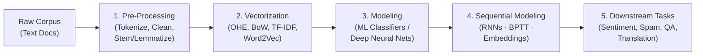

# Complete NLP (Natural Language Processing) Learning Roadmap

Welcome to the comprehensive Natural Language Processing study workspace. This repository tracks concepts, intuitive explanations, trade-offs, code implementations, and mathematical representations from raw text all the way to deep learning embeddings.

---

## 🗂️ Module Architecture

```
NLP/
├── 1. Text Pre-Processing/                     # Fundamentals of text cleaning & linguistic reduction
│   ├── 01_tokenization_and_nlp_basics.ipynb    # Tokenization deep dive & NLTK vs spaCy
│   ├── 02_stemming_techniques.ipynb            # Porter, Snowball, Regexp stemmers
│   ├── 03_lemmatization.ipynb                  # WordNetLemmatizer & POS sensitivity
│   ├── 04_stopwords_pos_tagging_ner.ipynb      # Stopwords filtering, POS tagging & NER
│   └── NLP_PREPROCESSING_MASTER_NOTES.md       # 📖 Comprehensive Master Reference Guide
│
├── 2. Text Pre-Processing/                     # Classical Feature Extraction (Text -> Sparse Vectors)
│   ├── 01_one_hot_encoding.ipynb               # One-Hot Encoding implementation & analysis
│   ├── 02_bag_of_words_practical.ipynb         # Bag of Words & CountVectorizer practical
│   ├── SMSSpam.txt                             # SMS spam classification dataset
│   ├── README.md                               # Module overview & index
│   └── NLP_VECTORIZATION_MASTER_NOTES.md       # 📖 Vectorization & Word Embeddings Master Guide
│
├── 3. Text Pre-Processing/                     # Dense Word Embeddings (Semantic Vectors)
│   ├── 01_word2vec_practical_implementation.ipynb # Pretrained Google News 300, analogies & custom Word2Vec
│   └── README.md                               # Module overview & index
│
├── 4. Recurrent Neural Networks/               # Sequence modelling with Simple RNNs (PyTorch)
│   ├── SIMPLE_RNN_MASTER_NOTES.md             # 📖 Visual RNN reference — BPTT, gradients, embeddings
│   ├── 01_simple_rnn_imdb_sentiment_analysis.ipynb # 🧪 End-to-end PyTorch RNN · IMDB · 76.5% accuracy
│   ├── app.py                                 # 🚀 Streamlit demo app
│   ├── simple_rnn_imdb.pth                   # 💾 Trained weights
│   ├── imdb_word_index.json                  # 📖 IMDB vocabulary (10k words)
│   └── README.md                             # Module guide & structural evaluation
│
└── Projects/                                   # End-to-End Classification Pipelines
    ├── 01_spam_ham_classification_bow_and_tfidf.ipynb # Spam classification with BoW & TF-IDF (leakage-free)
    ├── 02_spam_ham_classification_word2vec.ipynb      # Spam classification with Word2Vec & AvgWord2Vec
    ├── 03_kindle_review_sentiment_analysis.ipynb      # Kindle review sentiment analysis (BoW, TF-IDF & Word2Vec)
    └── README.md                                      # Projects index & best practices
```

---

## 🧭 The End-to-End NLP Pipeline



For exhaustive definitions, pros/cons, and cheat-sheets:
👉 **[Module 1: Pre-Processing Master Notes](./1.%20Text%20Pre-Processing/NLP_PREPROCESSING_MASTER_NOTES.md)**  
👉 **[Module 2 & 3: Vectorization & Word Embeddings Master Notes](./2.%20Text%20Pre-Processing/NLP_VECTORIZATION_MASTER_NOTES.md)**  
👉 **[Module 4: Simple RNN Master Notes](./4.%20Recurrent%20Neural%20Networks/SIMPLE_RNN_MASTER_NOTES.md)**  
👉 **[NLP Core Concepts & Technical Question Bank](./NLP_TECHNICAL_QUESTION_BANK.md)**

