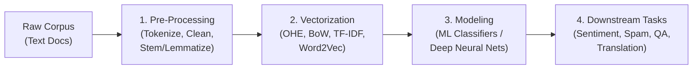

# Complete NLP (Natural Language Processing) Learning Roadmap

Welcome to the comprehensive Natural Language Processing study workspace. This repository tracks concepts, intuitive explanations, trade-offs, code implementations, and mathematical representations from raw text all the way to deep learning embeddings.

---

## 🗂️ Module Architecture

```
NLP/
├── 1. Text Pre-Processing/                     # Fundamentals of text cleaning & linguistic reduction
│   ├── 01_tokenization_and_nlp_basics.ipynb    # Tokenization deep dive & NLTK vs spaCy
│   ├── 02_stemming_techniques.ipynb            # Porter, Snowball, Regexp stemmers
│   ├── 03_lemmatization.ipynb                  # WordNetLemmatizer & POS sensitivity
│   ├── 04_stopwords_pos_tagging_ner.ipynb      # Stopwords filtering, POS tagging & NER
│   └── NLP_PREPROCESSING_MASTER_NOTES.md       # 📖 Comprehensive Master Reference Guide
│
├── 2. Text Pre-Processing/                     # Classical Feature Extraction (Text -> Sparse Vectors)
│   ├── 00_vectorization_intro.ipynb            # Introduction to Vectorization
│   └── 01_one_hot_encoding.ipynb               # One-Hot Encoding implementation & analysis
│   └── [Upcoming: Bag of Words (BoW), TF-IDF]
│
└── 3. Text Pre-Processing/                     # Dense Word Embeddings (Semantic Vectors)
    ├── 00_word_embeddings_intro.ipynb          # Introduction to Embeddings
    └── [Upcoming: Word2Vec, Average Word2Vec, Gensim]
```

---

## 🧭 The End-to-End NLP Pipeline



For exhaustive definitions, pros/cons, and cheat-sheets for Module 1, refer to:
👉 **[NLP Pre-Processing Master Notes](./1.%20Text%20Pre-Processing/NLP_PREPROCESSING_MASTER_NOTES.md)**
