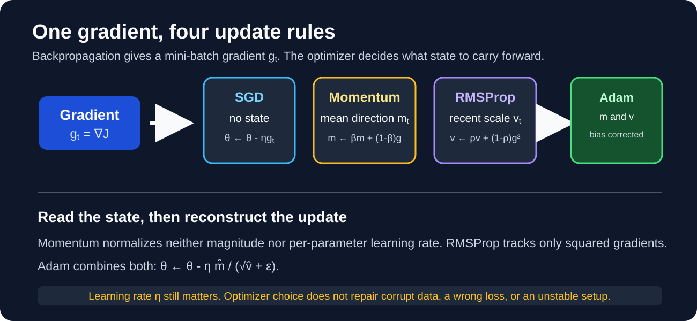

# Optimization, Stability, Initialization, and Dropout



## The training loop in one line

For parameters \(\theta\), a mini-batch \(\mathcal{B}_t\), loss \(J\), and learning rate \(\eta\), the basic update is:

\[
g_t=\nabla_\theta J_{\mathcal{B}_t}(\theta_t), \qquad \theta_{t+1}=\theta_t-\eta g_t
\]

An **optimizer** decides how \(g_t\) is transformed before the parameters move. Backpropagation computes gradients; the optimizer consumes them. Neither guarantees a global minimum for a non-convex neural-network loss.

**If you remember one thing:** training is repeated *estimate gradient -> transform it with optimizer state -> update parameters*.

### Epoch, step, iteration, and batch

For \(N\) examples and batch size \(B\), an epoch contains \(\lceil N/B \rceil\) optimizer updates. Many libraries call an optimizer update a **step** or **iteration**. With full-batch gradient descent, \(B=N\), so one epoch has one update. With mini-batches, it usually has many.

| Method | Gradient uses | Updates per epoch | Main tradeoff |
| --- | --- | ---: | --- |
| Batch GD | Every training example | 1 | Stable estimate, but expensive and memory-heavy. |
| SGD | One example | \(N\) | Cheap/noisy updates; useful for streaming but inefficient on accelerators. |
| Mini-batch SGD | \(B\) examples | \(\lceil N/B \rceil\) | Default practical choice: vectorized, bounded memory, moderately noisy. |

### Day 1 prompt

Your dataset has 50,000 examples and batch size 128. How many updates occur in one epoch? What changes if you use batch size 50,000?

## From plain SGD to Momentum

Plain SGD follows the gradient seen in the current batch. In a narrow valley, the gradient can alternate across the valley, producing sideways oscillation.

One common Momentum convention is:

\[
v_t = \mu v_{t-1}+g_t, \qquad \theta_{t+1}=\theta_t-\eta v_t
\]

Here \(\mu\in[0,1)\) retains part of the past direction. The exact signs and where \(\eta\) appears differ by implementation; track the library’s equation rather than memorizing one notation. Momentum smooths noisy directions and can accelerate movement along a consistent downhill direction. It can also overshoot when learning rate or momentum is too large.

**Desi intuition:** on a bumpy ghat road, reacting only to the current pothole causes left-right steering. Momentum preserves the road’s overall downhill direction. It does not mean ignoring the current road condition; the current gradient still changes the steering.

## Adaptive step sizes

Adaptive methods keep per-parameter state. A coordinate with consistently large gradients receives a smaller normalized step than one with small or infrequent gradients.

### AdaGrad

\[
r_t=r_{t-1}+g_t^2, \qquad
\theta_{t+1}=\theta_t-\frac{\eta}{\sqrt{r_t}+\epsilon}g_t
\]

All operations are elementwise. AdaGrad is useful when sparse/infrequent features need relatively larger updates. Its accumulator only grows, so its effective learning rate can shrink until learning stalls.

### RMSProp

RMSProp replaces the ever-growing accumulator with an exponential moving average:

\[
v_t=\rho v_{t-1}+(1-\rho)g_t^2, \qquad
\theta_{t+1}=\theta_t-\frac{\eta}{\sqrt{v_t}+\epsilon}g_t
\]

It responds to recent gradient scale instead of every gradient ever observed. Do not confuse \(v_t\) here with Momentum’s velocity: names differ across explanations, but the squared-gradient state is the key feature. See the [RMSProp source](../sources.md#external-sources).

### Adam

Adam combines a first-moment estimate (Momentum-like) and a second-moment estimate (RMSProp-like):

\[
m_t=\beta_1m_{t-1}+(1-\beta_1)g_t
\]
\[
v_t=\beta_2v_{t-1}+(1-\beta_2)g_t^2
\]
\[
\hat m_t=\frac{m_t}{1-\beta_1^t},\qquad
\hat v_t=\frac{v_t}{1-\beta_2^t}
\]
\[
\theta_{t+1}=\theta_t-\eta\frac{\hat m_t}{\sqrt{\hat v_t}+\epsilon}
\]

The bias correction matters at early steps because \(m_0=v_0=0\), which initially biases both moving averages toward zero. Adam is a strong baseline, not a universal default: optimizer choice, learning rate, schedule, regularization, and data all interact.

| Symptom | Likely first check |
| --- | --- |
| Loss explodes immediately | Learning rate, bad input scale, faulty labels/loss, initialization. |
| Loss spikes but later recovers | Batch noise, schedule, or a transient high gradient. Inspect the trend. |
| Training improves painfully slowly | Learning rate, wrong batch size, excessive regularization, or a saturated activation. |
| AdaGrad stops improving | Its accumulated squared gradients may have made steps tiny; consider RMSProp/Adam or a schedule. |

## Exploding gradients: a chain-rule problem

Backpropagation multiplies many local derivatives and weight Jacobians. If their typical magnitudes are repeatedly larger than one, gradient norms can grow exponentially with depth or sequence length. Symptoms include `inf`/`NaN` loss, enormous gradient norms, and parameter updates that destroy a previously reasonable model.

Useful responses are:

1. Verify data scale and learning rate.
2. Use an activation-matched initialization.
3. Add **gradient clipping** when a rare large update is the problem.
4. Use architectures/normalization methods appropriate to the model.

Clipping limits an update; it does not fix a systematically wrong loss, corrupt data, or learning rate. Gradient clipping by global norm applies \(g \leftarrow g\min(1,c/\lVert g\rVert)\) when \(\lVert g\rVert>c\).

## Initialization: preserve useful signal, break symmetry

All-zero weights make neurons in the same layer produce the same output and receive the same gradient, so they remain copies of one another. Random initialization breaks that symmetry. Random values must also have the right variance: too large can blow activations/gradients up; too small can shrink them toward zero.

Let `fan_in` be the number of inputs to a unit and `fan_out` its number of outputs.

| Initializer | Typical use | Normal form | Uniform bound |
| --- | --- | --- | --- |
| Glorot/Xavier | `tanh` or approximately symmetric activations | \(\mathcal N(0,\frac{2}{fan_{in}+fan_{out}})\) | \(\pm\sqrt{\frac{6}{fan_{in}+fan_{out}}}\) |
| He/Kaiming | ReLU-family activations | \(\mathcal N(0,\frac{2}{fan_{in}})\) | \(\pm\sqrt{\frac{6}{fan_{in}}}\) |

These are variance-preserving heuristics under modeling assumptions, not magic constants. The [Glorot paper](../sources.md#external-sources) motivates Xavier initialization; the [He paper](../sources.md#external-sources) derives a rectifier-aware alternative.

### Day 5 whiteboard drill

For a Dense layer with 128 inputs and 64 outputs followed by ReLU, which initializer is the sensible first choice? State the target variance and why it differs from Glorot.

## Dropout: train a thinned network, infer with the full one

Dropout randomly zeroes activations during **training**. It reduces harmful co-adaptation and acts like training many related thinned subnetworks. It is a regularizer, not a way to permanently remove unimportant neurons.

Let `rate = r` be the probability of dropping a unit and \(q=1-r\) the keep probability. Modern frameworks such as Keras use **inverted dropout**:

\[
\tilde h=\frac{m\odot h}{q}, \qquad m_i\sim\text{Bernoulli}(q)
\]

At inference, Keras applies no mask and no extra scaling because the training-time division by \(q\) already preserves the expected activation scale. Therefore `layers.Dropout(0.3)` means **drop 30%** of the input units during training, not keep 30% and not alter weights permanently. See [Keras Dropout](https://keras.io/api/layers/regularization_layers/dropout/).

Avoid dropout when the model is already underfitting. For convolutional feature maps, ordinary elementwise dropout is not always the best regularizer; use an evidence-driven choice such as data augmentation, weight decay, or `SpatialDropout2D` where appropriate.

## A compact Keras baseline

```python
import keras
from keras import layers

model = keras.Sequential([
    layers.Input(shape=(20,)),
    layers.Dense(64, activation="relu", kernel_initializer="he_normal"),
    layers.Dropout(0.30),
    layers.Dense(3, activation="softmax"),
])

model.compile(
    optimizer=keras.optimizers.Adam(learning_rate=1e-3),
    loss="sparse_categorical_crossentropy",
    metrics=["accuracy"],
)
```

The model chooses He initialization because the hidden activation is ReLU, Adam as a baseline optimizer, and `0.30` as a tunable dropout rate. Check validation loss and validation accuracy to decide whether the rate helps; do not infer generalization from training accuracy alone.

## One-screen recall map

```text
loss -> backprop gradient g_t -> optimizer state -> parameter update
               |                    |
               |                    +-- Momentum: mean direction
               |                    +-- RMSProp: recent squared scale
               |                    +-- Adam: both, with bias correction
               |
               +-- bad scale across depth? initialization / clipping / learning rate

overfitting? -> evaluate validation gap -> dropout during training only
```

**90-second explanation challenge:** Explain to a teammate why `Dropout(0.5)` behaves differently in `model.fit()` and `model.predict()`, then connect that answer to the expected activation value.
