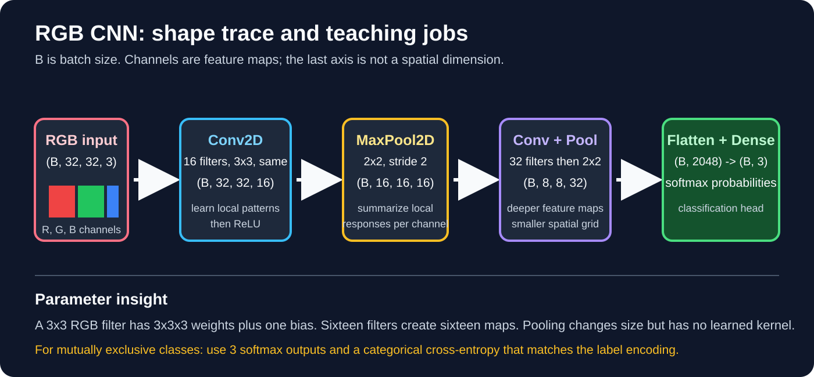

# CNN Foundations: From Pixels to Class Probabilities



## Orientation: where CNNs fit

The supplied architecture overview is useful for choosing the right model family, but this week teaches **CNN foundations only**.

| Family | Natural input structure | Typical role |
| --- | --- | --- |
| FNN / dense ANN | Fixed-length, non-spatial features | Tabular classification or regression. |
| CNN | Spatial grids | Images and other grid-like signals. |
| RNN | Ordered sequences with recurrent state | Sequence modelling; mainly historical context here. |
| Transformer | Token or image-patch sequences with attention | Language, vision, and multimodal modelling. |
| GAN | Generator and discriminator trained together | Synthesizing or transforming data. |

CNNs, RNNs, transformers, and GANs are not interchangeable upgrades. Their input structure, inductive bias, objective, and data needs differ. Treat the non-CNN families as a handoff map, not as material to memorize in this two-week module.

## Computer vision: task map

Computer vision turns image or video pixels into a useful label, location, mask, track, or representation. A classifier is only one kind of vision system.

| Task | Output | Example |
| --- | --- | --- |
| Image classification | One label or class distribution per image | `dog`, `cat`, or `horse`. |
| Object detection | Class plus bounding box for each object | Finding vehicles or products in a scene. |
| Segmentation | A class label for each pixel | Separating road, person, and background; outlining an organ. |
| Object tracking | The same object's identity across video frames | Following a car through a traffic video. |

CNNs are a foundation for all four, but detection, segmentation, and tracking require additional targets, heads, losses, and evaluation methods. Medical, surveillance, and safety-related examples also require domain validation; a class prediction is not a standalone diagnosis or decision.

## What a CNN changes relative to a dense ANN

A dense layer connects every input feature to every output unit. If a \(32\times32\times3\) image is flattened first, a Dense layer with 128 units has \(3072\times128+128=393{,}344\) parameters and does not encode that neighboring pixels are related.

A convolutional layer instead uses:

- **Local receptive fields:** a small kernel sees a local patch.
- **Parameter sharing:** the same kernel weights scan every spatial location.
- **Feature maps:** each learned filter produces one spatial response map.

This makes CNNs particularly useful for grid-like inputs such as images. The visual-cortex comparison from the supplied material is a historical intuition, not a claim that CNNs replicate the brain. CNN filters are learned by optimization from data.

## Image tensors

With Keras’s default `channels_last` format:

| Item | Shape |
| --- | --- |
| One grayscale image | \((H,W,1)\) |
| One RGB image | \((H,W,3)\) |
| Batch of RGB images | \((B,H,W,3)\) |

An 8-bit channel is commonly stored with values 0-255. RGB has three channels, not three separate examples. For a 324x324 image, grayscale contains \(324\times324\times1=104{,}976\) input values and RGB contains \(324\times324\times3=314{,}928\). A Full HD RGB frame has \(1920\times1080\times3=6{,}220{,}800\) input values. These are raw input values, not automatically useful features.

### Scaling, min-max normalization, and standardization

- **Known 8-bit scaling:** use `x / 255.0` when raw pixels are known to be in 0-255, giving a 0-1 range.
- **Min-max normalization:** \((x-x_{min})/(x_{max}-x_{min})\) maps a chosen range to 0-1, but can be sensitive to outliers.
- **Standardization:** \((x-\mu)/\sigma\) centers and scales values using statistics fit on the training split only.

Use the preprocessing specified by a pretrained model when transfer learning. Never compute normalization statistics from validation or test data: that leaks evaluation information into training.

### RGB convolution precisely

For input \((H,W,C_{in})\), a convolution layer with \(C_{out}\) filters and kernel \((K_h,K_w)\) has a kernel tensor shaped:

\[
(K_h,K_w,C_{in},C_{out})
\]

A single RGB filter therefore has depth 3, for example \(3\times3\times3\), and produces **one** output map after summing its channelwise products plus a bias. Thirty-two filters produce 32 output maps.

### Kernel anatomy and learned patterns

A 3x3 grayscale filter has 9 weights plus one bias. A 3x3 RGB filter has \(3\times3\times3=27\) weights plus one bias. With 32 RGB filters, that first layer has \((27+1)\times32=896\) trainable parameters.

Early filters may respond to edges, color contrasts, or textures; deeper layers combine earlier responses into more task-specific patterns. Edge detectors, sharpeners, and blurs are useful hand-crafted demonstrations, but a trained kernel is learned from the loss rather than assigned a permanent human label.

## Convolution is a learned sliding operation

Deep-learning libraries call this operation convolution, though it is usually cross-correlation mathematically: the kernel is not flipped. At each output location, multiply the local input patch and kernel elementwise, sum, add bias, then apply an activation such as ReLU.

\[
z_{i,j,o}=b_o+\sum_{u,v,c}x_{i+u,j+v,c}K_{u,v,c,o}
\]

At initialization, filters are random. During backpropagation, their values are updated so a filter may become sensitive to useful visual patterns. Hand-designed vertical/horizontal edge kernels are helpful teaching examples, not the normal training procedure.

### Spatial output size

For one spatial dimension:

\[
n_{out}=\left\lfloor\frac{n+2p-d(k-1)-1}{s}\right\rfloor+1
\]

where \(n\) is input size, \(k\) kernel size, \(p\) padding per side, \(s\) stride, and \(d\) dilation. For a 6x6 image, 3x3 kernel, `valid` padding, stride 1, dilation 1: \(6-3+1=4\), so the output is 4x4.

**Day 3 prompt:** Apply a 2x2 kernel \(\begin{bmatrix}1&0\\0&-1\end{bmatrix}\) to the top-left patch \(\begin{bmatrix}4&2\\1&3\end{bmatrix}\). What is the pre-activation value?

## Padding: preserve access to borders, not information magically

`valid` means no padding. `same` with stride 1 uses enough padding to preserve height and width. For an odd \(k\times k\) kernel at stride 1, choosing \(p=(k-1)/2\) gives `same` spatial size.

Zero padding is typical. It lets a kernel center reach border pixels and keeps spatial maps from shrinking rapidly. It introduces artificial zeros, so it does not literally preserve all information; it changes the boundary condition in a controlled way.

## Pooling: summarize a local window

Pooling has no learned kernel weights. It applies independently to each channel.

| Operation | Output of window \([1,3;2,4]\) | Usual role |
| --- | ---: | --- |
| Max pooling | 4 | Retain the strongest response in a local neighborhood. |
| Average pooling | 2.5 | Smooth local responses. |
| Min pooling | 1 | Rarely used; distinct from average/mean pooling. |

Max pooling with 2x2 window and stride 2 typically halves height and width when dimensions divide cleanly. It can give **limited local translation tolerance** because a strong nearby activation can remain the max in the same window. It does not make a model invariant to arbitrary translations, rotations, or scale changes.

For example, 2x2 max pooling with stride 2 transforms:

\[
\begin{bmatrix}1&3&2&1\\4&6&5&2\\7&2&8&3\\1&2&3&4\end{bmatrix}
\rightarrow
\begin{bmatrix}6&5\\7&8\end{bmatrix}
\]

## Canonical CNN pipeline

```text
image -> [Conv -> ReLU -> optional Pool] repeated
      -> Flatten or GlobalAveragePooling
      -> Dense head -> logits / softmax output
```

The repeated convolutional blocks form the **feature extractor**. The flatten/global-pooling plus Dense layers form the **task head**. The supplied course pipeline uses `Conv + Pool` blocks followed by `Flatten` and fully connected layers; that is the baseline you should be able to trace.

## CNN versus ANN: same training objective, different parameterization

| Aspect | Dense ANN on flattened image | CNN feature extractor |
| --- | --- | --- |
| Spatial relationship | Discarded when flattened | Preserved in feature-map axes. |
| Connectivity | Every input connects to every unit | Local kernel windows. |
| Parameters | Grow rapidly with input size | Shared across locations. |
| Learnable items | Dense weights and biases | Kernel weights and biases, then optional dense-head weights. |
| Backpropagation | Gradients update dense weights | Gradients update every shared kernel weight using all its uses. |

CNNs still use the Week 1 training loop: forward pass -> loss -> backpropagation -> optimizer update. A convolution layer plus ReLU is a common block, but ReLU is not mandatory; it supplies nonlinearity and usually helps gradients flow relative to saturating activations.

The image size alone explains why flattening can become expensive. A Full HD RGB frame flattened into a Dense layer with 128 units would require \(6{,}220{,}800\times128+128=796{,}262{,}528\) parameters in that one Dense layer. A CNN does not make computation free, but its shared local kernels avoid assigning a separate weight to every pixel-position-to-unit connection.

## From feature maps to a classifier

After several convolution/pooling blocks, a tensor might be \((B,8,8,32)\). `Flatten()` turns it into \((B,2048)\), which a Dense classifier can consume. For three mutually exclusive classes, use a 3-unit softmax output with `sparse_categorical_crossentropy` for integer labels, or `categorical_crossentropy` for one-hot labels.

The supplied sequence uses flattening followed by fully connected layers. It is valid and important to understand. In larger models, global average pooling is a common alternative that reduces parameters, but it is beyond the required pipeline rather than a replacement for learning flattening.

## End-to-end RGB example

```python
import keras
from keras import layers

model = keras.Sequential([
    layers.Input(shape=(32, 32, 3)),
    layers.Conv2D(16, 3, padding="same", activation="relu", kernel_initializer="he_normal"),
    layers.MaxPooling2D(pool_size=2),
    layers.Conv2D(32, 3, padding="same", activation="relu", kernel_initializer="he_normal"),
    layers.MaxPooling2D(pool_size=2),
    layers.Flatten(),
    layers.Dropout(0.30),
    layers.Dense(3, activation="softmax"),
])

model.compile(
    optimizer=keras.optimizers.Adam(learning_rate=1e-3),
    loss="sparse_categorical_crossentropy",
    metrics=["accuracy"],
)
```

Shape trace:

```text
(B, 32, 32, 3)
-> Conv2D(16, 3, same) -> (B, 32, 32, 16)
-> MaxPool(2)            -> (B, 16, 16, 16)
-> Conv2D(32, 3, same) -> (B, 16, 16, 32)
-> MaxPool(2)            -> (B,  8,  8, 32)
-> Flatten               -> (B, 2048)
-> Dense(3, softmax)     -> (B, 3)
```

The 3 softmax values are class probabilities only when the last layer is softmax. The predicted class is typically `argmax` of that vector. The model learns filter weights, dense weights, and biases; pooling does not learn a filter.

## Debugging checklist

| Symptom | First check |
| --- | --- |
| `ValueError` at first Conv2D layer | Input rank is 4 for a batch and channel count matches `input_shape`. |
| Dense shape unexpectedly huge | Confirm feature-map dimensions before `Flatten()`. |
| Output shape does not match labels | Number of softmax units, label encoding, and cross-entropy loss agree. |
| Training loss is `NaN` | Input scale, learning rate, labels, and numerical preprocessing. |
| Model predicts one class only | Class balance, label pipeline, final activation/loss pairing, and a small-overfit test. |

## Recall map

```text
RGB image (H, W, 3)
  -> learned local kernels (shared over positions)
  -> feature maps (H', W', filters)
  -> optional pooling (smaller H', W')
  -> flatten/dense head
  -> logits -> softmax -> class probabilities
```

**90-second explanation challenge:** Starting from a 32x32 RGB image, explain what one 3x3x3 filter does, why 16 filters give 16 maps, and how the model reaches three class probabilities. Name one shape at each stage.
